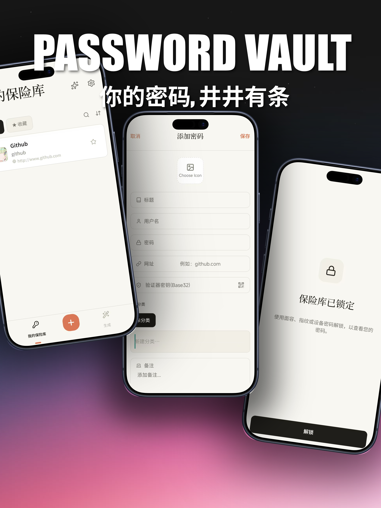
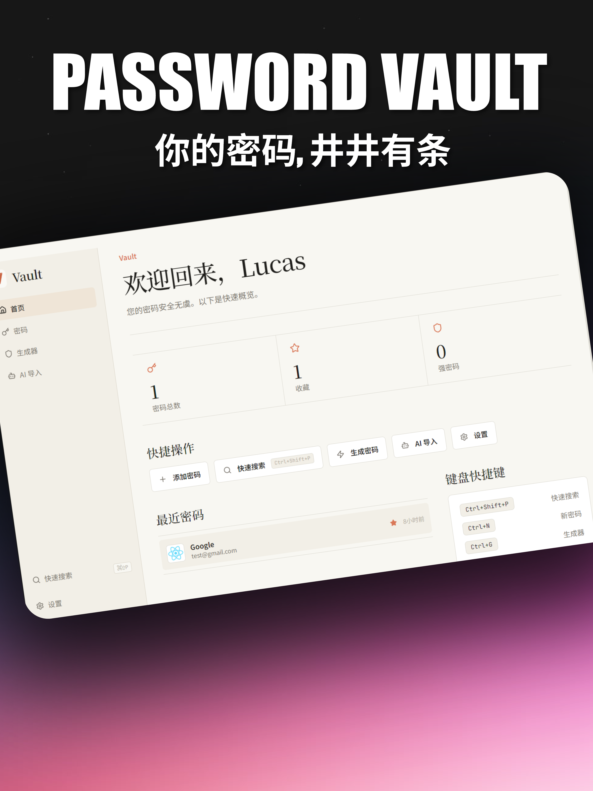

# Password Vault

[English](README.en.md) · [中文](README.md)

<p align="center">
  
  
</p>

> A local-first, master-password-protected password manager — one password for all your digital credentials.

**Website (Landing): https://www.vault.yoga**

Password Vault is a password manager built around local-first storage. Credentials are encrypted in a SQLite database on the device and protected by a master password and optional device biometrics. The repository is organized as a Turborepo monorepo with mobile, desktop, and landing applications, plus shared data, UI, internationalization, and AI import packages.

| App                             | Stack                   | Description                              |
| ------------------------------- | ----------------------- | ---------------------------------------- |
| 📱 **Mobile** (`apps/mobile`)   | Expo · React Native     | iOS / Android client                     |
| 🖥️ **Desktop** (`apps/desktop`) | Electron · React · Vite | macOS / Windows / Linux client           |
| 🌐 **Landing** (`apps/landing`) | Next.js                 | Product website and download entry point |

Installers are distributed through [GitHub Releases](https://github.com/LucasN0820/password-management/releases), and the website also provides platform download links.

### Features

**Password management**

- Create, edit, delete, favorite, search, filter, and sort password entries.
- Copy usernames, passwords, URLs, and TOTP codes from the detail view.
- Organize entries with categories and optional website favicons.

**Password generation and security**

- Generate random passwords with configurable length and character sets.
- Generate passphrases, inspect entropy and strength, and save results to the vault.
- Built-in TOTP support with live refresh, countdown, and `otpauth://` QR scanning.
- Health checks for weak, reused, expired, or breached passwords.

**Import, backup, and privacy**

- AI-assisted local import for CSV, PDF, images, DOCX, Markdown, and TXT files.
- Encrypted backup and restore, plus CSV export.
- Face ID / Touch ID / device PIN app lock, background privacy masking, screenshot protection, and automatic clipboard clearing.
- Chinese and English interfaces across the product.

**Desktop experience**

- Dashboard with vault summaries, favorites, strong-password counts, and recent entries.
- Global Spotlight search with `Ctrl/Cmd + Shift + P`.
- Keyboard shortcuts for creating entries, opening the generator, and closing overlays.
- Automatic updates through GitHub Releases.

### Architecture

The repository uses **Turborepo** and **Yarn 4.13.0** workspaces:

```text
password-management/
├── apps/
│   ├── mobile/        # Expo + React Native mobile app
│   ├── desktop/       # Electron + React + Vite desktop app
│   └── landing/       # Next.js website
├── packages/
│   ├── db/            # Encrypted SQLite data layer
│   ├── ui/            # Shared UI primitives and utilities
│   ├── i18n/          # Shared Chinese / English translations
│   └── ai-import-core/# AI document import core
└── config/            # Shared metadata, ESLint, and TypeScript config
```

The mobile and desktop apps share the password data model and Zustand store interface. Mobile uses `expo-sqlite`; desktop uses `better-sqlite3` behind Electron IPC. The landing app is a Next.js application with the same Chinese / English product language direction and automatic browser-language detection.

### Development

```bash
yarn install --immutable
yarn dev       # Start all apps through Turbo
yarn build     # Build all packages and apps
yarn lint      # Run ESLint across the workspace
yarn tsc       # Run TypeScript checks across the workspace
yarn format    # Format TypeScript, JavaScript, and Markdown files
```

To run one app directly:

```bash
cd apps/desktop && yarn dev   # Vite + Electron on port 5173
cd apps/mobile  && yarn dev   # Expo on port 8081
cd apps/landing && yarn dev   # Next.js on port 3001
```

### Releases

- Mobile releases use EAS Build and the `mobile-v*` tag workflow.
- Desktop releases use electron-builder and the `desktop-v*` tag workflow.
- The landing app is deployed to Vercel from the `main` branch.

See [README.md](README.md) for the complete build profiles, signing options, and required secrets.

### License and contribution

Password Vault is released under the MIT License. Issues and pull requests are welcome.

_Built with ❤️ and TypeScript._
