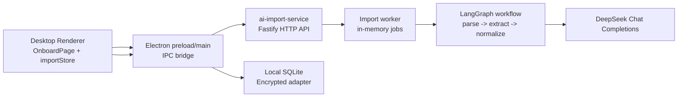

# Desktop AI Import Implementation

本文档记录当前项目中 `AI Import` 的真实实现状态，覆盖 Desktop 端、`ai-import-service` 服务、DeepSeek 调用、文件解析、鉴权、配置和发布相关行为。

## 当前目标

`AI Import` 的职责是让用户在 Desktop App 中选择本地文件，将文件上传到独立的 Node.js 服务 `ai-import-service`，由服务解析文件并调用 DeepSeek 提取账号密码候选项。用户在 Desktop App 中人工 review、编辑、取消勾选后，再保存到本地加密数据库。

当前实现不是纯本地 AI import。重型解析和模型调用已经抽离到 `apps/ai-import-service`，Desktop App 只负责文件选择、上传、轮询、review 和保存。

## 技术架构



主要模块：

- Desktop UI: `apps/desktop/src/routes/Onboard/index.tsx`
- Desktop store: `apps/desktop/src/store/importStore.ts`
- Electron IPC: `apps/desktop/electron/main.ts`
- Preload API: `apps/desktop/electron/preload.ts`
- Desktop service config: `apps/desktop/electron/settings.ts`
- Service entry: `apps/ai-import-service/src/index.ts`
- Service routes: `apps/ai-import-service/src/routes/import.routes.ts`
- Job state: `apps/ai-import-service/src/services/job.service.ts`
- Worker: `apps/ai-import-service/src/workers/import.worker.ts`
- Workflow: `apps/ai-import-service/src/langgraph/workflow.ts`
- Parser: `apps/ai-import-service/src/langgraph/parser.ts`
- DeepSeek provider: `apps/ai-import-service/src/langgraph/deepseek.ts`

## Desktop 端流程

### 1. 选择文件

用户在 `OnboardPage` 点击 `Choose Files` 后调用：

```ts
window.electronAPI.selectImportFiles()
```

Electron main process 通过 `dialog.showOpenDialog` 打开本地文件选择器。当前 Desktop 端文件过滤只允许：

- `.csv`
- `.pdf`
- `.docx`
- `.md`
- `.markdown`
- `.txt`

返回给 renderer 的文件描述结构为：

```ts
interface ImportFileDescriptor {
  path: string
  name: string
  size: number
  extension: string
}
```

注意：`ai-import-service` 的 parser 代码中仍保留了图片扩展名支持判断，但 Desktop UI 当前不会让用户选择图片。DeepSeek provider 目前没有图片提取实现，图片会返回“不支持”的错误。

### 2. 启动导入

用户点击 `Start AI Import` 后，`importStore.runImport()` 将状态切换为 `processing`，然后调用：

```ts
window.electronAPI.runImportWorkflow(files)
```

Electron main process 会：

1. 从配置中读取 `AI_IMPORT_SERVICE_URL` 和 `AI_IMPORT_SERVICE_SECRET`
2. 将本地文件读取成 `Blob`
3. 通过 `multipart/form-data` 上传到 `${serviceUrl}/import/jobs`
4. 请求头带上 `Authorization: Bearer ${secret}`
5. 获得 `jobId` 后每 1 秒轮询 `${serviceUrl}/import/jobs/:jobId`
6. job 完成后把 `ImportWorkflowResult` 返回给 renderer

如果服务 URL 或 secret 不存在，Desktop 端会抛出：

```text
Env not found.
```

### 3. Review 和保存

服务返回候选项后，`importStore` 将状态切换为 `review`，并给每个 candidate 增加 `selected: true`。

用户可以在 UI 中编辑：

- title
- url
- username
- password
- notes

也可以取消勾选或删除单条候选项。点击 `Save Selected` 后调用：

```ts
window.electronAPI.saveImportedPasswords(candidates)
```

Electron main process 对数据做 zod 校验，然后调用 `passwordAdapter.addPassword` 保存。当前保存时固定：

- `category: 'imported'`
- `isFavorite: false`
- `icon: null`

数据库写入经过 `createEncryptedAdapter`，密码和 notes 会先加密再写入本地 SQLite。

## ai-import-service 流程

### 服务启动

`apps/ai-import-service/src/index.ts` 使用 Fastify 启动 HTTP 服务。

配置加载顺序：

1. 查找 monorepo workspace root
2. 加载根目录 `.env`
3. 加载根目录 `.env.local`，并允许覆盖 `.env`

服务监听：

```ts
host = '0.0.0.0'
port = Number(process.env.PORT ?? '3001')
```

这适配 Railway 等平台：Railway 会通过 `PORT` 注入端口，`0.0.0.0` 允许容器外部访问。

### 环境变量

当前相关变量统一放在项目根目录 `.env` / `.env.local` 管理：

```env
AI_IMPORT_SERVICE_URL=http://localhost:3001
AI_IMPORT_SERVICE_SECRET=...
DEEPSEEK_API_KEY=...
DEEPSEEK_MODEL=deepseek-v4-pro
MAX_FILE_SIZE_MB=25
```

说明：

- `AI_IMPORT_SERVICE_URL`: Desktop App 调用服务的 HTTP 地址。
- `AI_IMPORT_SERVICE_SECRET`: Desktop App 和服务之间的共享 secret，用于 Bearer 鉴权。
- `DEEPSEEK_API_KEY`: 服务调用 DeepSeek API 的 key。
- `DEEPSEEK_MODEL`: DeepSeek 模型名，默认 `deepseek-v4-pro`。
- `MAX_FILE_SIZE_MB`: Fastify multipart 层面的上传文件大小限制，默认 25MB。

Desktop 打包时，GitHub Actions 支持通过 secrets 或 workflow input 注入：

- `AI_IMPORT_SERVICE_URL`
- `AI_IMPORT_SERVICE_SECRET`

打包脚本会生成 `apps/desktop/build/desktop-env.json`，并通过 electron-builder 的 `extraResources` 打进安装包。生产包运行时会从 `process.resourcesPath/desktop-env.json` 读取服务配置。

### 鉴权

除健康检查外，所有 import API 都需要：

```http
Authorization: Bearer <AI_IMPORT_SERVICE_SECRET>
```

未配置服务 secret 时返回 500：

```json
{
  "error": {
    "code": "INTERNAL_ERROR",
    "message": "Service API key not configured"
  }
}
```

请求未带 secret 或 secret 不匹配时返回 401：

```json
{
  "error": {
    "code": "UNAUTHORIZED",
    "message": "Invalid or missing API key"
  }
}
```

创建 job 前还会检查 `DEEPSEEK_API_KEY`。如果服务端没有配置 DeepSeek key，会返回：

```json
{
  "error": {
    "code": "MISSING_API_KEY",
    "message": "DEEPSEEK_API_KEY is not configured"
  }
}
```

### HTTP API

#### `GET /import/health`

无需鉴权，用于健康检查。

响应示例：

```json
{
  "status": "ok",
  "timestamp": "2026-04-26T00:00:00.000Z"
}
```

#### `POST /import/jobs`

需要 Bearer 鉴权。接收 `multipart/form-data`，字段名为 `files`。

行为：

1. 校验 DeepSeek API key 是否配置
2. 创建临时目录 `os.tmpdir()/ai-import-<uuid>`
3. 流式写入上传文件
4. 校验文件扩展名
5. 创建内存 job
6. 后台异步执行 `processJob(job)`
7. 立即返回 202 和 `jobId`

响应示例：

```json
{
  "jobId": "uuid",
  "status": "queued",
  "createdAt": "2026-04-26T00:00:00.000Z"
}
```

#### `GET /import/jobs/:jobId`

需要 Bearer 鉴权。Desktop 端用它轮询任务状态。

可能状态：

- `queued`
- `processing`
- `completed`
- `failed`
- `cancelled`

完成后会返回：

```ts
interface ImportWorkflowResult {
  files: ImportFileResult[]
  candidates: ImportCandidateDraft[]
  warnings: string[]
}
```

#### `DELETE /import/jobs/:jobId`

需要 Bearer 鉴权。用于请求取消任务。

当前服务端会：

1. 标记 cancellation requested
2. 从内存 job map 删除 job
3. 返回 `cancelled`

注意：Desktop UI 目前的 Cancel 只是 reset 当前前端状态，没有调用该 DELETE API，因此还不是完整的远程取消。

## LangGraph 工作流

`runImportWorkflow(files)` 内部使用 LangGraph StateGraph，当前节点顺序固定：


### `parseFiles`

逐个文件调用 `parseImportFile(file)`。成功时生成 `ParsedImportFile`，失败时记录 warning 和 file result。

支持解析：

- CSV: 读取 UTF-8 文本，并尝试结构化列映射
- PDF: 使用 `pdf2json` 提取文本
- DOCX: 使用 `mammoth.extractRawText`
- TXT / MD / Markdown: 读取 UTF-8 文本
- 图片: parser 可读取为 base64，但 DeepSeek provider 当前不支持图片提取

parser 内部还会：

- 标准化换行和空白
- 将长文本切分成 chunk
- 按关键词、URL、email、分隔符等启发式评分
- 选择最多 6 段相关 excerpt 传给模型

### CSV 结构化预填充

CSV 有一条快捷路径：如果表头能识别出 password 字段，则不调用 DeepSeek，直接构造高置信度 candidate。

可识别字段：

- title: `title`, `name`, `service`, `site`, `website name`
- username: `username`, `user`, `login`, `account`, `email`
- password: `password`, `pass`, `secret`
- url: `url`, `website`, `site url`, `login url`
- notes: `notes`, `memo`, `remark`

CSV 结构化候选项默认置信度：

```ts
CSV_STRUCTURED_CONFIDENCE = 0.96
```

### `extractCandidates`

对每个 parsed file 调用：

- text: `extractCredentialsFromTextFile`
- image: `extractCredentialsFromImageFile`

当前 image provider 直接抛错：

```text
Image import is not supported by the current DeepSeek provider
```

text provider 如果已经存在 CSV prefilled candidates，则直接返回，不再调用 DeepSeek。

### `normalizeCandidates`

对候选项做去重和排序。

去重 fingerprint 使用：

- title lower-case
- username lower-case
- password
- url lower-case

fingerprint 经过 SHA-256 hash 作为 key。如果重复，保留 confidence 更高的一条。最后按 confidence 降序返回。

## DeepSeek Provider

DeepSeek 调用文件：

```text
apps/ai-import-service/src/langgraph/deepseek.ts
```

当前 API：

```text
POST https://api.deepseek.com/chat/completions
```

请求配置：

```json
{
  "model": "deepseek-v4-pro",
  "response_format": { "type": "json_object" },
  "temperature": 0,
  "max_tokens": 2000,
  "stream": false
}
```

模型必须返回 JSON：

```json
{
  "candidates": [
    {
      "title": "service name",
      "username": "login or email",
      "password": "plaintext password",
      "url": "https://example.com or null",
      "notes": "supporting detail or null",
      "confidence": 0.0,
      "sourceExcerpt": "short evidence excerpt"
    }
  ]
}
```

服务端会用 zod 校验模型响应，并过滤掉没有 password 的候选项。

为了容错，provider 会尝试从以下格式中提取 JSON：

1. 纯 JSON
2. ```json fenced code block
3. 文本中的第一个 `{ ... }` 对象

## 数据结构

候选项结构：

```ts
interface ImportCandidateDraft {
  id: string
  sourceFile: string
  title: string
  username: string
  password: string
  url: string | null
  notes: string | null
  confidence: number
  sourceExcerpt: string
}
```

文件处理结果：

```ts
interface ImportFileResult {
  fileName: string
  extension: string
  status: 'processed' | 'failed'
  candidateCount: number
  warning?: string
}
```

完整 workflow 返回：

```ts
interface ImportWorkflowResult {
  files: ImportFileResult[]
  candidates: ImportCandidateDraft[]
  warnings: string[]
}
```

## 安全设计

当前已有安全措施：

- Desktop 和 service 之间用 `AI_IMPORT_SERVICE_SECRET` 做 Bearer 鉴权。
- DeepSeek API key 只存在服务端环境变量中，Desktop App 不直接持有 DeepSeek key。
- 上传文件保存到系统临时目录，job 完成、失败或取消后 worker 会清理临时目录。
- Desktop 保存导入结果时走加密数据库 adapter，敏感字段不会明文落库。
- 打包时 `desktop-env.json` 被加入 `.gitignore`，避免本地构建配置进入仓库。

当前仍需注意：

- `AI_IMPORT_SERVICE_SECRET` 是共享 secret，不是设备级签名；泄露后需要轮换。
- 服务端 job 状态保存在内存中，服务重启会丢失 job。
- Desktop 端还没有调用远程 cancel API。
- DeepSeek 调用会发送候选文本 excerpt 到云端模型服务，需要在产品层面明确隐私边界。
- 日志中应继续避免打印密码、token、完整文件内容和模型原始输出。

## Railway 部署说明

当前 `ai-import-service` 已适配 Railway 的基本运行方式：

- 使用 `process.env.PORT` 作为优先端口
- 监听 `0.0.0.0`
- 不再依赖 `localhost` 作为服务 host
- 健康检查地址为 `/import/health`

Railway 上至少需要配置：

```env
AI_IMPORT_SERVICE_SECRET=...
DEEPSEEK_API_KEY=...
DEEPSEEK_MODEL=deepseek-v4-pro
MAX_FILE_SIZE_MB=25
```

Desktop 打包时则需要把 Railway 生成的公网地址配置为：

```env
AI_IMPORT_SERVICE_URL=https://<your-railway-domain>
AI_IMPORT_SERVICE_SECRET=...
```

## GitHub Actions 打包集成

`release-desktop.yml` 当前支持在 Desktop 打包时注入：

- `AI_IMPORT_SERVICE_URL`
- `AI_IMPORT_SERVICE_SECRET`

workflow 会构建 macOS、Windows、Linux 三端安装包，并在 `desktop-v*` tag 触发时创建对应 GitHub Release。当前 release 发布不再依赖 electron-builder 自动发布，而是在所有平台构建完成后显式上传产物到当前 tag。

这避免了 electron-builder 根据 `package.json` 默认发布到 `v<version>`，导致和项目使用的 `desktop-v<version>` tag 不一致。

## 已知限制和后续 TODO

- Desktop UI 的 `Cancel` 还没有调用 `DELETE /import/jobs/:jobId`，只是清空本地 store。
- 服务端 job 是内存态，不适合多实例部署，也不支持服务重启恢复。
- 图片导入在 parser 层有入口，但 DeepSeek provider 目前不支持图片提取，Desktop 端也已隐藏图片选择。
- PDF 解析只走 `pdf2json` 文本提取，对扫描型 PDF 没有 OCR fallback。
- DOCX 只提取 raw text，对复杂表格结构没有专门优化。
- CSV 只支持一批常见英文表头映射。
- Review 页面支持编辑和单条删除，但还没有批量选择、重复检测、按文件分组等增强能力。
- 没有 import history / staging table，review 数据只存在前端内存中。
- 没有针对 workflow、parser、DeepSeek 响应解析的自动化测试。

## 建议下一步

优先级较高的后续工作：

1. 让 Desktop 端保存 `jobId`，并在 Cancel 时调用远程 `DELETE /import/jobs/:jobId`。
2. 将 job state 从内存迁移到 Redis 或数据库，以支持 Railway 上更稳的运行和多实例扩展。
3. 为 parser、CSV prefill、DeepSeek JSON extraction 增加单元测试。
4. 增加服务端请求 trace id，但继续避免记录敏感字段。
5. 增加 OCR 或明确移除 parser 层图片支持，保持 UI、服务和 provider 能力一致。
6. 增加 import staging/history，支持导入记录、撤销和问题排查。
