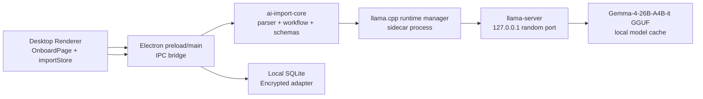
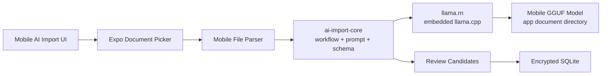

# Desktop AI Import Local LLM Roadmap

本文档定义 `AI Import` 从远端 `DeepSeek` 提取迁移到 Desktop App 内置
`llama.cpp` 本地大模型提取的目标方案。目标模型族为
`Gemma-4-26B-A4B`，实际本地推理建议使用 instruction-tuned GGUF artifact：
`ggml-org/gemma-4-26B-A4B-it-GGUF:Q4_K_M`。

## 背景和目标

当前 AI Import 的主要风险是：导入文件里可能包含明文账号、密码、token、
恢复码、备注等高度敏感信息。旧方案会把文件上传到远端 `ai-import-service`，
再由服务调用 DeepSeek。即使只发送筛选后的 text excerpts，仍然存在敏感数据
离开用户设备的问题。

新的目标是：

- 文件解析、文本筛选、模型提取、候选项归一化全部在用户本机完成。
- 默认不上传原始文件、文本片段、prompt、模型输出、密码候选项到任何远端服务。
- 保留现有 review-first 产品流程：AI 只生成候选项，用户确认后才入库。
- 使用 `llama.cpp` 作为本地推理 runtime，用 Gemma 4 26B A4B 的 GGUF 量化版本
  替代 `DeepSeek Chat Completions`。
- 将远端 `ai-import-service` 降级为 legacy / optional provider，不再作为默认路径。

## 目标架构



关键变化：

- Desktop App 不再把 import 文件上传到公网服务。
- Electron main process 负责本地文件读取、临时文件管理、llama.cpp 进程生命周期。
- Parser、workflow、候选项 schema 从 `apps/ai-import-service` 抽到共享 core 包。
- DeepSeek provider 替换为 `local-llama` provider。
- `llama-server` 只监听 `127.0.0.1`，端口由 App 动态分配。

## 模型选择

### 目标模型

用户指定模型为 `Gemma-4-26B-A4B`。用于密码提取时应优先使用指令微调版本：

```text
Base model: google/gemma-4-26B-A4B
Runtime model: ggml-org/gemma-4-26B-A4B-it-GGUF:Q4_K_M
Format: GGUF
Runtime: llama.cpp / llama-server
```

选择 instruction-tuned 版本的原因：

- 当前任务是结构化信息抽取，需要模型遵循 system prompt 和 JSON schema。
- `it` 版本更适合 chat/completions 与受控输出。
- GGUF 量化版本可以直接由 `llama.cpp` 加载。

### 模型体积和硬件门槛

`ggml-org/gemma-4-26B-A4B-it-GGUF` 当前公开量化体积大致为：

| Quant    |    Size | 用途                        |
| -------- | ------: | --------------------------- |
| `Q4_K_M` | 16.8 GB | 默认推荐，质量和体积折中    |
| `Q8_0`   | 26.9 GB | 高质量模式，硬件要求更高    |
| `BF16`   | 50.5 GB | 不建议普通 Desktop 默认使用 |

产品侧建议：

- 默认下载 `Q4_K_M`。
- 首次使用 AI Import 时提示模型下载，不把模型塞进安装包。
- 下载目录使用 `app.getPath('userData')/models/`。
- 下载完成后做 SHA-256 校验。
- 如果本机内存/显存不足，提示用户切换小模型或远端 legacy provider。
- 普通用户不需要配置 `AI_IMPORT_MODEL_PATH`；该变量只用于开发、调试或手动指定模型。

> 注意：26B A4B 虽然是 MoE / active-parameter 友好架构，但 Q4 模型文件仍然是
> 16GB 级别。CPU-only 机器可能能跑，但体验会慢；优先使用 Metal / CUDA /
> Vulkan 等 llama.cpp backend。

## Desktop 端业务流程

### 1. 选择文件

保持当前 UI 入口不变：

```ts
window.electronAPI.selectImportFiles();
```

当前 Desktop 端文件过滤继续支持：

- `.csv`
- `.pdf`
- `.docx`
- `.md`
- `.markdown`
- `.txt`

返回结构保持不变：

```ts
interface ImportFileDescriptor {
  path: string;
  name: string;
  size: number;
  extension: string;
}
```

### 2. 启动本地导入

旧调用：

```ts
window.electronAPI.runImportWorkflow(files);
```

可以保留 API 名称，但实现改为本地 workflow。Electron main process 内部执行：

1. 确认本地模型是否存在。
2. 如果不存在，引导用户下载模型。
3. 启动或复用 `llama-server` sidecar。
4. 在本机解析文件。
5. CSV 可结构化识别时直接生成候选项，不调用模型。
6. 对非结构化文本选择高相关 excerpts。
7. 调用本地 `http://127.0.0.1:<port>/v1/chat/completions`。
8. 校验 JSON 输出并返回 `ImportWorkflowResult` 给 renderer。

### 3. Review 和保存

保持现有 review-first 流程：

- 所有 candidate 默认 `selected: true`。
- 用户可编辑 title、url、username、password、notes。
- 用户可取消勾选或删除候选项。
- 点击 `Save Selected` 后才写入本地 SQLite。
- 保存仍然走 `createEncryptedAdapter`，敏感字段加密落库。

## 本地 llama.cpp Runtime 设计

建议新增模块：

```text
apps/desktop/electron/ai-import/
  local-import-job.ts
  llama-runtime.ts
  local-llama-provider.ts
  model-cache.ts
  prompt.ts
  json-schema.ts

packages/ai-import-core/
  parser.ts
  workflow.ts
  types.ts
  normalize.ts
```

### `llama-runtime.ts`

职责：

- 查找平台对应的 `llama-server` binary。
- 选择动态空闲端口。
- 以 child process 启动本地 server。
- 确认 `/health` 或 `/v1/models` 可访问。
- 管理进程退出、超时、取消、异常恢复。
- 只允许监听 `127.0.0.1`。

启动命令示例：

```bash
llama-server \
  -m "<userData>/models/gemma-4-26B-A4B-it-Q4_K_M.gguf" \
  --host 127.0.0.1 \
  --port 0 \
  -c 8192 \
  -ngl auto
```

实际实现里 `--port 0` 是否可用要按当前 llama.cpp 版本验证；如果不可用，
Electron 先探测空闲端口，再传入固定端口。

### `model-cache.ts`

职责：

- 管理模型下载状态。
- 存储模型 metadata。
- 校验 SHA-256。
- 支持用户删除模型、重新下载、切换 quant。

建议 metadata：

```ts
interface LocalModelManifest {
  id: 'gemma-4-26B-A4B-it';
  repo: 'ggml-org/gemma-4-26B-A4B-it-GGUF';
  quant: 'Q4_K_M';
  fileName: 'gemma-4-26B-A4B-it-Q4_K_M.gguf';
  sizeBytes: number;
  sha256: string;
  downloadedAt: string;
}
```

### `local-llama-provider.ts`

替代当前 `deepseek.ts`。职责：

- 组装 system/user prompt。
- 调用本地 OpenAI-compatible chat completions API。
- 设置低温度和有限 token。
- 尽量启用 JSON schema / grammar 约束。
- 使用 zod 校验模型响应。
- 过滤掉没有 password 的候选项。

请求示例：

```ts
const response = await fetch(`${baseUrl}/v1/chat/completions`, {
  method: 'POST',
  headers: {
    'Content-Type': 'application/json',
  },
  body: JSON.stringify({
    model: 'gemma-4-26B-A4B-it',
    messages: [
      { role: 'system', content: systemPrompt },
      { role: 'user', content: userPrompt },
    ],
    temperature: 0,
    max_tokens: 2000,
    stream: false,
    response_format: {
      type: 'json_object',
    },
  }),
});
```

如果当前 llama.cpp 版本支持 schema-constrained JSON，应优先使用 JSON schema。
如果行为不稳定，则使用 `--grammar-file` 启动 server，并保留现有的 JSON fallback：

1. 纯 JSON。
2. `json` fenced code block。
3. 文本中的第一个 `{ ... }` 对象。

## Prompt 和输出结构

本地模型必须输出：

```json
{
  "candidates": [
    {
      "title": "service name",
      "username": "login or email",
      "password": "plaintext password",
      "url": "https://example.com or null",
      "notes": "supporting detail or null",
      "confidence": 0.0,
      "sourceExcerpt": "short evidence excerpt"
    }
  ]
}
```

Prompt 原则：

- 明确说明只做密码管理记录抽取。
- 没有明确 password 时不要返回。
- 不要猜测、不要补全不存在字段。
- `sourceExcerpt` 必须来自 evidence excerpt，且保持简短。
- 输出只允许 JSON。
- 对中文字段名保持支持，例如：账号、密码、邮箱、网址、备注。

## 文件解析策略

继续复用当前 parser 策略：

- CSV: UTF-8 文本读取，并尝试结构化列映射。
- PDF: 使用 `pdf2json` 提取文本。
- DOCX: 使用 `mammoth.extractRawText`。
- TXT / MD / Markdown: 读取 UTF-8 文本。

CSV 快捷路径继续保留：

- 如果能识别 password 字段，直接生成高置信度 candidate。
- 不调用本地模型，减少延迟和敏感文本进入 prompt 的范围。
- 继续使用 `CSV_STRUCTURED_CONFIDENCE = 0.96`。

非结构化文本继续做：

- 标准化换行和空白。
- 长文本 chunking。
- 按 password、username、login、account、email、url、账号、密码等关键词评分。
- 最多选择 6 段相关 excerpt 传给本地模型。

## 状态管理和取消

本地模式不需要 Redis，也不需要远端 job API。

建议 Desktop main 维护进程内 job：

```ts
interface LocalImportJob {
  id: string;
  status: 'queued' | 'processing' | 'completed' | 'failed' | 'cancelled';
  files: ImportFileDescriptor[];
  abortController: AbortController;
  result?: ImportWorkflowResult;
  error?: { code: string; message: string };
}
```

取消行为：

- Renderer 调用 `window.electronAPI.cancelImportWorkflow()`。
- Electron main abort 当前 job。
- 如果模型请求正在进行，取消本地 fetch。
- 如果没有其他导入任务，允许保留 `llama-server` 热启动一段时间，或立即退出。
- 清理临时文件和内存中的 candidate。

## 配置变化

旧远端变量：

```env
AI_IMPORT_SERVICE_URL=...
AI_IMPORT_SERVICE_SECRET=...
DEEPSEEK_API_KEY=...
DEEPSEEK_MODEL=...
```

本地模式目标变量：

```env
AI_IMPORT_PROVIDER=local-llama
AI_IMPORT_MODEL_REPO=ggml-org/gemma-4-26B-A4B-it-GGUF
AI_IMPORT_MODEL_QUANT=Q4_K_M
AI_IMPORT_MODEL_FILE=gemma-4-26B-A4B-it-Q4_K_M.gguf
AI_IMPORT_MODEL_SHA256=
AI_IMPORT_MODEL_DOWNLOAD_URL=
AI_IMPORT_MODEL_PATH=
AI_IMPORT_LLAMA_SERVER_PATH=
AI_IMPORT_CONTEXT_SIZE=8192
AI_IMPORT_MAX_TOKENS=2000
AI_IMPORT_KEEP_SERVER_ALIVE_MS=300000
```

说明：

- `AI_IMPORT_PROVIDER`: 默认 `local-llama`。
- `AI_IMPORT_MODEL_REPO`: Hugging Face GGUF repo。
- `AI_IMPORT_MODEL_QUANT`: 默认 `Q4_K_M`。
- `AI_IMPORT_MODEL_FILE`: 默认 `gemma-4-26B-A4B-it-Q4_K_M.gguf`。
- `AI_IMPORT_MODEL_SHA256`: 可选，配置后下载完成必须匹配该 hash。
- `AI_IMPORT_MODEL_DOWNLOAD_URL`: 可选，用于覆盖默认 Hugging Face 下载地址。
- `AI_IMPORT_MODEL_PATH`: 高级覆盖项。普通用户不需要配置，默认由 App 下载到模型缓存目录。
- `AI_IMPORT_LLAMA_SERVER_PATH`: 高级覆盖项。普通用户不需要配置，默认使用 App 内置 `llama-server`。
- `AI_IMPORT_CONTEXT_SIZE`: 默认 8192，后续可根据硬件和模型能力上调。
- `AI_IMPORT_KEEP_SERVER_ALIVE_MS`: 导入结束后保留本地 server 的时间。

## 安全设计

本地模式必须满足：

- 默认不发起任何远端模型请求。
- `llama-server` 只监听 `127.0.0.1`。
- 不把原始文件内容、prompt、模型原始输出、password、token 写入日志。
- 临时文件只保存在本机系统 temp 目录，完成或取消后清理。
- Renderer 不直接读取文件内容，不直接持有模型 prompt。
- 生产环境关闭自动打开 DevTools。
- 模型下载必须校验 hash。
- 模型来源必须固定 allowlist，避免任意 URL 下载带来的供应链风险。
- Review 页面继续人工确认，不允许 silent import。

还需要在 UI 上明确：

- 本地模式：文件和密码内容不会上传到云端模型。
- Legacy remote 模式：会把文件或文本片段发送到远端服务，仅用于显式开启。

## 发布和打包

不建议把 16GB+ 模型打进安装包。推荐：

1. 安装包携带平台对应的 `llama-server` binary，放在
   `apps/desktop/bin/llama.cpp/<platform>-<arch>/` 后通过 `extraResources` 打进包。
2. 开发态可以用 `AI_IMPORT_LLAMA_SERVER_PATH` 指向外部 `llama-server`。
3. 首次 AI Import 时下载 GGUF 模型到用户数据目录。
4. 下载使用 `.partial` 临时文件，成功后写入 manifest。
5. 设置页显示模型状态、路径和 SHA-256。
6. CI 只验证 runtime wrapper，不上传大模型 artifact。

平台注意事项：

- macOS: 优先使用 Metal backend。
- Windows: 优先提供 Vulkan / CUDA build；没有 GPU 时 fallback CPU。
- Linux: 优先 Vulkan / CUDA，提供 CPU fallback。
- Apple Silicon 用户体验预计最好；普通 Windows CPU-only 机器需要明确性能提示。

## 迁移计划

### Phase 1: 抽离 core

- 把 `apps/ai-import-service/src/langgraph/types.ts` 抽到 `packages/ai-import-core`。
- 把 parser、CSV prefill、normalize 逻辑抽到 core。
- 保持 Desktop UI 和 `importStore` 不变。

### Phase 2: 本地 provider

- 新增 `local-llama-provider.ts`。
- 实现 llama.cpp OpenAI-compatible chat completions 调用。
- 保留 DeepSeek provider 作为 legacy provider。
- 为 JSON extraction 和 zod schema 增加单元测试。

### Phase 3: Runtime manager

- 新增 `llama-runtime.ts`。
- 实现 `llama-server` 启动、健康检查、端口管理、进程清理。
- 实现 model cache 和下载校验。
- Settings 页面增加本地模型状态。

### Phase 4: 默认切换

- `AI_IMPORT_PROVIDER` 默认改为 `local-llama`。
- Onboard 文案改成本地隐私模式。
- 移除默认远端服务配置依赖。
- 远端 import API 仅保留为开发/兼容入口。

### Phase 5: 质量和性能

- 增加 fixtures 回归测试。
- 测试 CSV、PDF、DOCX、TXT、MD。
- 对比本地 Gemma 与旧 DeepSeek 输出质量。
- 记录非敏感性能指标：文件数、耗时、candidate 数、失败原因类型。

## Mobile llama.cpp 接入方案

Mobile 端同样需要满足文件内容、prompt、模型输出和密码候选项不离开用户设备的
安全目标，但不能直接复制 Desktop 的 `llama-server` sidecar 方案。iOS 和 Android
不适合由 App 启动长期运行的本地 HTTP 子进程，因此 Mobile 应将 `llama.cpp`
作为原生库嵌入 App，并通过 React Native native module 直接调用。

### Mobile 目标架构



与 Desktop 的主要区别：

| 能力           | Desktop                     | Mobile                                 |
| -------------- | --------------------------- | -------------------------------------- |
| llama.cpp 接入 | 启动 `llama-server` 子进程  | 原生库嵌入 App                         |
| 调用方式       | 本地 OpenAI-compatible HTTP | React Native native module             |
| 模型目录       | 4B 到 26B GGUF              | 0.6B 到 1.7B GGUF                      |
| GPU backend    | Metal / CUDA / Vulkan       | iOS Metal；Android GPU 或 CPU fallback |
| 文件读取       | Node `fs`                   | Expo FileSystem / native parser        |
| 取消           | Abort HTTP + 停止 sidecar   | 停止 completion + 释放 native context  |

### Runtime 选型

第一阶段建议使用 `llama.rn`，不自行维护 Swift、Kotlin、JNI 和 llama.cpp C++
桥接：

- iOS 和 Android 直接嵌入 llama.cpp。
- 支持加载本地 GGUF、completion、token streaming、停止生成和释放 context。
- 支持 JSON Schema / grammar constrained output，可降低无效 JSON 比例。
- 提供 Expo config plugin，可纳入当前 Expo prebuild 和 EAS Build 流程。
- 当前 Mobile App 已启用 React Native New Architecture，可使用 development build
  验证原生模块。

由于 `llama.rn` 包含自定义原生代码：

- 不能使用 Expo Go 验证该功能。
- 本地开发使用 `expo run:ios`、`expo run:android` 或自定义 development build。
- CI / 发布使用 EAS Build。
- 必须在安装依赖或修改 config plugin 后重新运行 prebuild / native build。

如果 `llama.rn` 在目标设备矩阵中存在无法解决的稳定性、架构或发布问题，再新建
独立 Expo Native Module 包装锁定版本的 llama.cpp。第一版不建议直接选择该维护
成本更高的路径。

### `ai-import-core` 跨平台重构

当前 `packages/ai-import-core` 不能直接运行在 React Native/Hermes：

- `parser.ts` 直接依赖 Node `fs`、`path`、`crypto`、`Buffer`。
- PDF 和 DOCX 解析依赖 `pdf2json`、`mammoth` 等 Node-oriented package。
- `normalize.ts` 使用 Node `crypto.createHash()`。
- `workflow.ts` 直接 import Node parser，并使用 LangGraph 执行简单顺序工作流。

目标是让 core 只保留平台无关逻辑，将文件读取、文件解析、ID 和 fingerprint
实现注入 workflow：

```ts
interface ImportWorkflowDependencies {
  parseFile: (file: ImportFileDescriptor) => Promise<ParsedImportFile>;
  extractCandidates: ImportExtractor;
  createId: () => string;
  createFingerprint: (candidate: ImportCandidateDraft) => Promise<string>;
}

runImportWorkflow(files, dependencies);
```

建议目录：

```text
packages/ai-import-core/
  types.ts
  workflow.ts
  prompt.ts
  schema.ts
  excerpts.ts
  csv.ts
  normalize.ts

apps/desktop/electron/ai-import/
  desktop-file-parser.ts
  desktop-llama-extractor.ts

apps/mobile/src/features/ai-import/
  mobile-file-parser.ts
  mobile-llama-extractor.ts
  model-manager.ts
  import-store.ts
```

core 重构原则：

- Prompt、Zod schema、JSON fallback、candidate mapping 和 excerpt scoring 在两个平台
  间复用。
- CSV 表头识别和确定性 candidate 生成在 core 中复用。
- Desktop 与 Mobile 只实现不同的文件读取和模型调用 adapter。
- `randomUUID` 由 Desktop Node crypto 或 Mobile `expo-crypto` 注入。
- candidate 去重不必依赖 cryptographic hash；可以使用稳定字段组合 key，或注入平台
  fingerprint 实现。
- 当前 workflow 只有 parse、extract、normalize 三个顺序步骤，可以改成普通
  TypeScript orchestration，避免 Mobile bundle 引入不必要的 LangGraph runtime。

### Mobile 模型目录

Mobile 不复用 Desktop 的 Gemma 4 26B、gpt-oss 20B 或默认 Qwen3 4B 模型目录。
这些模型的磁盘和运行内存要求不适合作为普通手机默认配置。

建议建立独立 allowlist：

| 模型                | 建议角色          | 适用设备                  |
| ------------------- | ----------------- | ------------------------- |
| Qwen3 0.6B Q4_0     | 快速 / 低内存模式 | 低端 Android、较旧 iPhone |
| Gemma 3 1B QAT Q4_0 | 平衡模式候选      | 普通中高端设备            |
| Qwen3 1.7B Q4_0     | 高质量默认候选    | 8GB RAM 或以上设备        |

最终默认模型不能只按通用 benchmark 决定，应使用本文后续定义的密码提取评测集
进行真机质量和性能比较。初始 POC 可以优先验证 Qwen3 1.7B，并以 Gemma 3 1B、
Qwen3 0.6B 作为资源降级选项。

Phase 0-2 实现固定使用以下 allowlist。Mobile 选择 `Q4_0` 而不是 `Q4_K_M`，以兼容
当前 `llama.rn` Android OpenCL backend：

| 角色   | Hugging Face artifact                                         |          Size | SHA-256                                                            |
| ------ | ------------------------------------------------------------- | ------------: | ------------------------------------------------------------------ |
| 默认   | `bartowski/Qwen_Qwen3-1.7B-GGUF/Qwen_Qwen3-1.7B-Q4_0.gguf`    | 1,231,813,024 | `c470091d31c4ada174ee5c2547daa020e930593cbca5ca8ca385ce8ff59a2fdf` |
| 平衡   | `ggml-org/gemma-3-1b-it-qat-GGUF/gemma-3-1b-it-qat-Q4_0.gguf` |   720,425,600 | `ef60e4e91a738c99ae9976b050657dfe68a4007a0ccca121b55ec0c413dccd58` |
| 低内存 | `bartowski/Qwen_Qwen3-0.6B-GGUF/Qwen_Qwen3-0.6B-Q4_0.gguf`    |   469,671,328 | `4b78d8e3c61976cebb78ef5affe19d0eca75b1b47ec66f613a5a3245484758d5` |

建议初始推理参数：

```ts
interface MobileModelRuntimeConfig {
  contextSize: 2048;
  batchSize: 256;
  gpuLayers: number;
  temperature: 0;
  maxTokens: 1200;
}
```

参数需要按设备动态调整：

- 可用内存不足时降低 context、batch 或切换更小模型。
- 一次只加载一个 model context。
- 默认串行处理文件和 excerpts，避免同时生成导致 OOM。
- 导入完成后短暂保留 context；App 进入后台、收到内存警告、用户取消或发生异常时
  立即停止 completion 并释放 context。

### 模型下载和缓存

Mobile 模型不打进安装包，避免显著增加 App Store / Play Store 下载体积。

模型管理要求：

- GGUF 保存到 App document directory 下的 `models/`，而不是易被系统清理的 cache。
- 只允许下载 Mobile catalog 中固定 repo、fileName 和 hash 的 artifact。
- 使用 `.partial` 文件，成功校验后再原子重命名。
- 支持进度、速度、预计剩余时间、取消、失败重试和删除。
- SHA-256 必须流式计算，不能把 1GB 级 GGUF 整体读入 JS 内存。
- manifest 记录 model id、path、size、hash、下载时间和最后使用时间。
- 删除当前已加载模型前，先停止 generation 并释放 native context。

Expo FileSystem 负责下载和文件生命周期；如果当前 Expo API 无法流式计算大文件
hash，则由轻量 Expo Native Module 提供 native streaming SHA-256，而不是在 JS 中
读取完整文件。

### Mobile 文件解析策略

第一阶段只完成风险最低、最容易验证的文本闭环：

- CSV：优先确定性列映射，不调用模型。
- TXT / Markdown：通过 Expo FileSystem 读取 UTF-8 文本。
- 限制单文件大小、文件数量和本次导入的总文本量。
- 文件选择使用 Expo Document Picker，并复制到 App 可读的临时目录。
- 解析完成、取消或失败后删除临时副本。

第二阶段再增加：

- PDF：使用 iOS / Android 原生文本提取 adapter。
- DOCX：使用跨平台 ZIP/XML parser 或 native parser，不能直接复用 Node `mammoth`。
- 图片和扫描 PDF：先使用 Apple Vision / Google ML Kit OCR，再把纯文本交给本地模型。

第一版不建议运行 Mobile multimodal GGUF。OCR 与文本小模型分工可以降低模型体积、
内存峰值和平台差异。

### Mobile extractor

Mobile extractor 与 Desktop 使用相同 prompt 和 credential schema，但模型调用改为
native completion：

```ts
async function extractWithMobileLlama(
  context: LlamaContext,
  file: ParsedTextFile,
  signal?: AbortSignal
) {
  if (file.prefilledCandidates.length > 0) {
    return file.prefilledCandidates;
  }

  const result = await context.completion({
    messages: buildCredentialMessages(file),
    temperature: 0,
    n_predict: 1200,
    response_format: {
      type: 'json_schema',
      json_schema: credentialJsonSchema,
    },
  });

  return parseCredentialCandidates(result.text, file.file.name);
}
```

要求：

- 优先使用 JSON Schema 转 grammar 的 constrained generation。
- 仍然保留纯 JSON、fenced JSON 和对象片段 fallback。
- 所有输出必须经过 Zod 校验。
- 没有明确 password 的 candidate 必须过滤。
- `sourceExcerpt` 必须来自输入 evidence，不接受模型虚构内容。
- 每次 generation 都可以被用户取消。

### Mobile 产品流程

1. 用户从 Mobile AI Import 页面选择文件。
2. App 尝试 CSV 确定性解析。
3. 查询默认 Mobile model 是否已下载且通过校验。
4. 未准备时进入模型下载步骤。
5. 加载 native llama context，并显示加载状态。
6. 串行解析文件、选择相关 excerpts、提取 candidates。
7. 显示文件进度和当前阶段，允许取消。
8. 对 candidates 做 schema 校验、字段归一化和去重。
9. 进入与 Desktop 一致的 review-first 页面。
10. 用户确认后，通过 Mobile 已有 encrypted adapter 写入 SQLite。
11. 清理临时文件，并根据内存状态释放 model context。

Mobile 端不得自动保存模型输出。即使专项评测达到上线门槛，密码和账号配对仍需要
用户确认。

### 准确率策略

目前没有公开的“从密码文件提取账号和密码”专项 benchmark。通用聊天、数学或代码
benchmark 不能直接代表密码字段的 exact-match 能力，也不能据此声明具体准确率。

模型能力预期只能作为 POC 排序：

| 模型          | 初始质量预期   | 主要风险                             |
| ------------- | -------------- | ------------------------------------ |
| Qwen3 0.6B Q4 | 较低           | 跨行字段、复杂配对和无关文本容易失败 |
| Gemma 3 1B Q4 | 中等           | 中文混合文本和复杂格式需要专项验证   |
| Qwen3 1.7B Q4 | 三者中预期最好 | 内存、速度、发热和 Android 设备差异  |

数据类型也会显著影响最终结果：

- 规范 CSV 使用确定性 parser，目标应接近完全正确，不计入模型准确率。
- 明确的 `username / password` 标签文本最适合小模型。
- 多账号混排、跨行字段和自由格式笔记容易发生漏提取或账号密码错配。
- PDF / DOCX 的最终结果同时受 parser 质量影响。
- OCR 输入必须单独统计 OCR 字符错误，因为密码要求 exact match，单字符错误也属于
  提取失败。

### 专项评测集

上线前建立至少 300 个脱敏或合成样本，并持续扩展：

- 中文、英文和中英文混合。
- CSV、TXT、Markdown；后续加入 PDF、DOCX 和 OCR。
- 单账号、多账号、跨行字段、表格、自由格式笔记。
- 无密码和只有用户名的负样本。
- password 包含空格、引号、反斜杠、Unicode、换行、长字符串和特殊符号。
- API key、OTP、恢复码、Wi-Fi 密码等容易混淆的字段。
- 内容被截断、重复、字段顺序改变和存在大量无关文本的样本。

核心指标：

```text
Password exact-match precision / recall / F1
Record exact-match accuracy
Username-password pairing accuracy
Field-level precision / recall / F1
False-positive record rate
No-password hallucination rate
JSON/schema valid rate
Per-file latency
Peak memory
Cancellation latency
Thermal and battery impact
```

推荐首版上线门槛：

- Password exact-match recall >= 95%。
- Username-password pairing accuracy >= 95%。
- 无密码文档误报率 <= 1%。
- JSON/schema valid rate >= 99.5%。
- 不允许出现已知的 password 字符修改、自动纠错或补全行为。
- 所有候选项必须经过 review，不能因为达到门槛就自动入库。

评测结果必须按模型、quant、平台、设备等级和文件类型分桶，不能只报告一个整体
平均数。例如 Qwen3 1.7B 在新款 iPhone 上可运行，不代表低内存 Android 也能达到
同样质量和延迟。

如果 Qwen3 1.7B 在专项数据集上仍无法达到门槛，优先顺序为：

1. 改进 deterministic parser 和 evidence excerpt 选择。
2. 修正 prompt、JSON schema 和 grammar。
3. 增加规则校验，拒绝证据不足的 candidate。
4. 对 1B 到 2B 模型做密码提取 LoRA / QLoRA 微调。
5. 最后才考虑更大模型，因为移动端成本主要受内存和发热限制。

### Mobile 实施阶段

#### Mobile Phase 0: 真机 POC

- 集成 `llama.rn` development build。
- 在至少两代 iPhone、Pixel、Samsung 和一台低内存 Android 上验证。
- 比较 Qwen3 0.6B、Gemma 3 1B、Qwen3 1.7B 的加载时间、token speed、峰值内存、
  发热和取消行为。
- 使用 50 到 100 个早期 fixture 测试字段 exact match。

#### Mobile Phase 1: Core 跨平台化

- 将 parser 从 core workflow 中解耦。
- 将 prompt、schema、JSON parser、CSV parser、excerpt scoring 和 normalize 保留在 core。
- 移除 core 对 Node `fs/path/crypto/Buffer` 的硬依赖。
- 评估并移除 Mobile 不需要的 LangGraph runtime。

#### Mobile Phase 2: 文本导入闭环

- 接入 Document Picker、Mobile file parser 和 model manager。
- 支持 CSV、TXT、MD。
- 实现 model download、hash、manifest、删除和默认选择。
- 实现 native completion、进度、取消和 review 页面。
- 复用 encrypted SQLite 保存路径。

Phase 0-2 的首版产品边界固定为：

- iOS 与 Android 手机；保留平板可运行配置，但不做平板专项验收。
- Vault 顶部独立入口，功能在达到专项评测门槛前标记为 Experimental。
- CSV、TXT、MD / Markdown；最多 5 个文件、单文件 5MB、总计 15MB。
- 模型以 `.partial` 下载到 document directory，完成流式 SHA-256 校验后原子改名。
- 候选项必须进入可编辑 review，保存通过 encrypted adapter 的单事务批量写入。
- Expo Go 不在支持范围内，开发与验收使用 development build / EAS Build。

#### Mobile Phase 3: 稳定性和设备降级

- 根据可用内存选择模型和 runtime 参数。
- 增加后台切换、内存警告、OOM、下载中断和 context 加载失败恢复。
- 增加设备不支持提示和小模型 fallback。
- 完成 iOS / Android EAS Build 和商店发布验证。

#### Mobile Phase 4: 文档和 OCR

- 增加 PDF 和 DOCX native parser。
- 增加 Apple Vision / ML Kit OCR。
- 将 parser 错误、OCR 错误和模型错误分开统计。
- 扩展专项评测集并重新确认上线门槛。

### Mobile 验收标准

- 断网状态下完成 CSV、TXT、MD 的选择、解析、模型提取、review 和加密保存。
- 导入过程中不访问远端 LLM、远端 import service 或上传用户文件。
- 不依赖 Expo Go，development build 和 EAS production build 均能加载 native runtime。
- 模型下载支持进度、取消、失败重试、hash 校验和删除。
- App 进入后台、取消导入或发生错误后不会遗留仍在生成的 native context。
- 低内存设备能够降级到较小模型，无法运行时提供明确提示而不是崩溃。
- CSV 确定性解析不会无必要地调用模型。
- 模型输出通过 schema 校验并进入 review，不会自动写入数据库。
- 专项评测达到定义的 password exact-match、配对准确率和误报率门槛。
- 真机测试覆盖 iOS、Pixel、Samsung 和低内存 Android，不以模拟器结果替代真机。

## 已知限制

- `Gemma-4-26B-A4B-it Q4_K_M` 模型体积大，首次下载成本高。
- CPU-only 推理速度可能较慢。
- llama.cpp 对 Gemma 4、JSON schema、multimodal 的支持需要锁定具体版本验证。
- 当前计划只迁移文本提取；图片 OCR / multimodal 导入后续单独设计。
- 扫描型 PDF 仍然需要 OCR fallback，否则 parser 无法提取文字。
- 本地模型仍可能误提取或漏提取，因此 review-first 不能取消。
- Mobile 小模型的准确率、峰值内存、发热和耗电存在明显设备差异。
- Android GPU backend 和驱动差异可能导致部分设备只能使用 CPU fallback。
- Mobile PDF、DOCX 和 OCR 需要独立平台 parser，不能直接复用 Desktop Node parser。

## 验收标准

- 断网状态下可以完成 CSV/TXT/MD/DOCX/PDF 文本型导入。
- 默认流程不访问 `api.deepseek.com`、Railway 或任何远端 import service。
- 抓包验证导入过程中没有文件内容或 prompt 离开本机。
- `llama-server` 仅监听 `127.0.0.1`。
- 取消导入会停止当前 job，并清理临时文件。
- 保存后密码和 notes 仍通过 encrypted adapter 写入 SQLite。
- 自动化测试覆盖 parser、CSV prefill、JSON extraction、candidate normalize。

## 参考资料

- Google Gemma 4 model card:
  <https://huggingface.co/google/gemma-4-26B-A4B>
- Gemma 4 26B A4B instruct GGUF:
  <https://huggingface.co/ggml-org/gemma-4-26B-A4B-it-GGUF>
- llama.cpp:
  <https://github.com/ggml-org/llama.cpp>
- llama.cpp server:
  <https://github.com/ggml-org/llama.cpp/blob/master/tools/server/README.md>
- llama.rn:
  <https://github.com/mybigday/llama.rn>
- Expo custom native code:
  <https://docs.expo.dev/workflow/customizing/>
- Expo FileSystem:
  <https://docs.expo.dev/versions/latest/sdk/filesystem/>
- Expo DocumentPicker:
  <https://docs.expo.dev/versions/latest/sdk/document-picker/>
- llama.cpp Android:
  <https://github.com/ggml-org/llama.cpp/blob/master/docs/android.md>
- Gemma 3 1B instruct GGUF:
  <https://huggingface.co/ggml-org/gemma-3-1b-it-GGUF>
- Qwen3 0.6B GGUF:
  <https://huggingface.co/Qwen/Qwen3-0.6B-GGUF>
- Qwen3 1.7B GGUF:
  <https://huggingface.co/Qwen/Qwen3-1.7B-GGUF>
