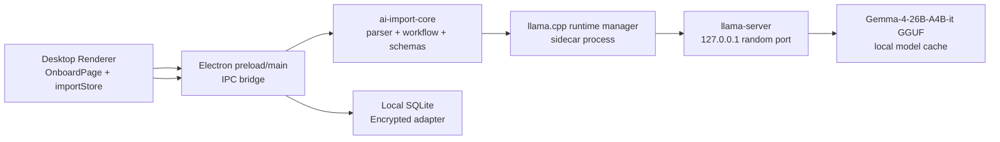

# Desktop AI Import Local LLM Roadmap

本文档定义 `AI Import` 从远端 `DeepSeek` 提取迁移到 Desktop App 内置
`llama.cpp` 本地大模型提取的目标方案。目标模型族为
`Gemma-4-26B-A4B`，实际本地推理建议使用 instruction-tuned GGUF artifact：
`ggml-org/gemma-4-26B-A4B-it-GGUF:Q4_K_M`。

## 背景和目标

当前 AI Import 的主要风险是：导入文件里可能包含明文账号、密码、token、
恢复码、备注等高度敏感信息。旧方案会把文件上传到远端 `ai-import-service`，
再由服务调用 DeepSeek。即使只发送筛选后的 text excerpts，仍然存在敏感数据
离开用户设备的问题。

新的目标是：

- 文件解析、文本筛选、模型提取、候选项归一化全部在用户本机完成。
- 默认不上传原始文件、文本片段、prompt、模型输出、密码候选项到任何远端服务。
- 保留现有 review-first 产品流程：AI 只生成候选项，用户确认后才入库。
- 使用 `llama.cpp` 作为本地推理 runtime，用 Gemma 4 26B A4B 的 GGUF 量化版本
  替代 `DeepSeek Chat Completions`。
- 将远端 `ai-import-service` 降级为 legacy / optional provider，不再作为默认路径。

## 目标架构



关键变化：

- Desktop App 不再把 import 文件上传到公网服务。
- Electron main process 负责本地文件读取、临时文件管理、llama.cpp 进程生命周期。
- Parser、workflow、候选项 schema 从 `apps/ai-import-service` 抽到共享 core 包。
- DeepSeek provider 替换为 `local-llama` provider。
- `llama-server` 只监听 `127.0.0.1`，端口由 App 动态分配。

## 模型选择

### 目标模型

用户指定模型为 `Gemma-4-26B-A4B`。用于密码提取时应优先使用指令微调版本：

```text
Base model: google/gemma-4-26B-A4B
Runtime model: ggml-org/gemma-4-26B-A4B-it-GGUF:Q4_K_M
Format: GGUF
Runtime: llama.cpp / llama-server
```

选择 instruction-tuned 版本的原因：

- 当前任务是结构化信息抽取，需要模型遵循 system prompt 和 JSON schema。
- `it` 版本更适合 chat/completions 与受控输出。
- GGUF 量化版本可以直接由 `llama.cpp` 加载。

### 模型体积和硬件门槛

`ggml-org/gemma-4-26B-A4B-it-GGUF` 当前公开量化体积大致为：

| Quant | Size | 用途 |
| --- | ---: | --- |
| `Q4_K_M` | 16.8 GB | 默认推荐，质量和体积折中 |
| `Q8_0` | 26.9 GB | 高质量模式，硬件要求更高 |
| `BF16` | 50.5 GB | 不建议普通 Desktop 默认使用 |

产品侧建议：

- 默认下载 `Q4_K_M`。
- 首次使用 AI Import 时提示模型下载，不把模型塞进安装包。
- 下载目录使用 `app.getPath('userData')/models/`。
- 下载完成后做 SHA-256 校验。
- 如果本机内存/显存不足，提示用户切换小模型或远端 legacy provider。
- 普通用户不需要配置 `AI_IMPORT_MODEL_PATH`；该变量只用于开发、调试或手动指定模型。

> 注意：26B A4B 虽然是 MoE / active-parameter 友好架构，但 Q4 模型文件仍然是
> 16GB 级别。CPU-only 机器可能能跑，但体验会慢；优先使用 Metal / CUDA /
> Vulkan 等 llama.cpp backend。

## Desktop 端业务流程

### 1. 选择文件

保持当前 UI 入口不变：

```ts
window.electronAPI.selectImportFiles()
```

当前 Desktop 端文件过滤继续支持：

- `.csv`
- `.pdf`
- `.docx`
- `.md`
- `.markdown`
- `.txt`

返回结构保持不变：

```ts
interface ImportFileDescriptor {
  path: string
  name: string
  size: number
  extension: string
}
```

### 2. 启动本地导入

旧调用：

```ts
window.electronAPI.runImportWorkflow(files)
```

可以保留 API 名称，但实现改为本地 workflow。Electron main process 内部执行：

1. 确认本地模型是否存在。
2. 如果不存在，引导用户下载模型。
3. 启动或复用 `llama-server` sidecar。
4. 在本机解析文件。
5. CSV 可结构化识别时直接生成候选项，不调用模型。
6. 对非结构化文本选择高相关 excerpts。
7. 调用本地 `http://127.0.0.1:<port>/v1/chat/completions`。
8. 校验 JSON 输出并返回 `ImportWorkflowResult` 给 renderer。

### 3. Review 和保存

保持现有 review-first 流程：

- 所有 candidate 默认 `selected: true`。
- 用户可编辑 title、url、username、password、notes。
- 用户可取消勾选或删除候选项。
- 点击 `Save Selected` 后才写入本地 SQLite。
- 保存仍然走 `createEncryptedAdapter`，敏感字段加密落库。

## 本地 llama.cpp Runtime 设计

建议新增模块：

```text
apps/desktop/electron/ai-import/
  local-import-job.ts
  llama-runtime.ts
  local-llama-provider.ts
  model-cache.ts
  prompt.ts
  json-schema.ts

packages/ai-import-core/
  parser.ts
  workflow.ts
  types.ts
  normalize.ts
```

### `llama-runtime.ts`

职责：

- 查找平台对应的 `llama-server` binary。
- 选择动态空闲端口。
- 以 child process 启动本地 server。
- 确认 `/health` 或 `/v1/models` 可访问。
- 管理进程退出、超时、取消、异常恢复。
- 只允许监听 `127.0.0.1`。

启动命令示例：

```bash
llama-server \
  -m "<userData>/models/gemma-4-26B-A4B-it-Q4_K_M.gguf" \
  --host 127.0.0.1 \
  --port 0 \
  -c 8192 \
  -ngl auto
```

实际实现里 `--port 0` 是否可用要按当前 llama.cpp 版本验证；如果不可用，
Electron 先探测空闲端口，再传入固定端口。

### `model-cache.ts`

职责：

- 管理模型下载状态。
- 存储模型 metadata。
- 校验 SHA-256。
- 支持用户删除模型、重新下载、切换 quant。

建议 metadata：

```ts
interface LocalModelManifest {
  id: 'gemma-4-26B-A4B-it'
  repo: 'ggml-org/gemma-4-26B-A4B-it-GGUF'
  quant: 'Q4_K_M'
  fileName: 'gemma-4-26B-A4B-it-Q4_K_M.gguf'
  sizeBytes: number
  sha256: string
  downloadedAt: string
}
```

### `local-llama-provider.ts`

替代当前 `deepseek.ts`。职责：

- 组装 system/user prompt。
- 调用本地 OpenAI-compatible chat completions API。
- 设置低温度和有限 token。
- 尽量启用 JSON schema / grammar 约束。
- 使用 zod 校验模型响应。
- 过滤掉没有 password 的候选项。

请求示例：

```ts
const response = await fetch(`${baseUrl}/v1/chat/completions`, {
  method: 'POST',
  headers: {
    'Content-Type': 'application/json',
  },
  body: JSON.stringify({
    model: 'gemma-4-26B-A4B-it',
    messages: [
      { role: 'system', content: systemPrompt },
      { role: 'user', content: userPrompt },
    ],
    temperature: 0,
    max_tokens: 2000,
    stream: false,
    response_format: {
      type: 'json_object',
    },
  }),
})
```

如果当前 llama.cpp 版本支持 schema-constrained JSON，应优先使用 JSON schema。
如果行为不稳定，则使用 `--grammar-file` 启动 server，并保留现有的 JSON fallback：

1. 纯 JSON。
2. `json` fenced code block。
3. 文本中的第一个 `{ ... }` 对象。

## Prompt 和输出结构

本地模型必须输出：

```json
{
  "candidates": [
    {
      "title": "service name",
      "username": "login or email",
      "password": "plaintext password",
      "url": "https://example.com or null",
      "notes": "supporting detail or null",
      "confidence": 0.0,
      "sourceExcerpt": "short evidence excerpt"
    }
  ]
}
```

Prompt 原则：

- 明确说明只做密码管理记录抽取。
- 没有明确 password 时不要返回。
- 不要猜测、不要补全不存在字段。
- `sourceExcerpt` 必须来自 evidence excerpt，且保持简短。
- 输出只允许 JSON。
- 对中文字段名保持支持，例如：账号、密码、邮箱、网址、备注。

## 文件解析策略

继续复用当前 parser 策略：

- CSV: UTF-8 文本读取，并尝试结构化列映射。
- PDF: 使用 `pdf2json` 提取文本。
- DOCX: 使用 `mammoth.extractRawText`。
- TXT / MD / Markdown: 读取 UTF-8 文本。

CSV 快捷路径继续保留：

- 如果能识别 password 字段，直接生成高置信度 candidate。
- 不调用本地模型，减少延迟和敏感文本进入 prompt 的范围。
- 继续使用 `CSV_STRUCTURED_CONFIDENCE = 0.96`。

非结构化文本继续做：

- 标准化换行和空白。
- 长文本 chunking。
- 按 password、username、login、account、email、url、账号、密码等关键词评分。
- 最多选择 6 段相关 excerpt 传给本地模型。

## 状态管理和取消

本地模式不需要 Redis，也不需要远端 job API。

建议 Desktop main 维护进程内 job：

```ts
interface LocalImportJob {
  id: string
  status: 'queued' | 'processing' | 'completed' | 'failed' | 'cancelled'
  files: ImportFileDescriptor[]
  abortController: AbortController
  result?: ImportWorkflowResult
  error?: { code: string; message: string }
}
```

取消行为：

- Renderer 调用 `window.electronAPI.cancelImportWorkflow()`。
- Electron main abort 当前 job。
- 如果模型请求正在进行，取消本地 fetch。
- 如果没有其他导入任务，允许保留 `llama-server` 热启动一段时间，或立即退出。
- 清理临时文件和内存中的 candidate。

## 配置变化

旧远端变量：

```env
AI_IMPORT_SERVICE_URL=...
AI_IMPORT_SERVICE_SECRET=...
DEEPSEEK_API_KEY=...
DEEPSEEK_MODEL=...
```

本地模式目标变量：

```env
AI_IMPORT_PROVIDER=local-llama
AI_IMPORT_MODEL_REPO=ggml-org/gemma-4-26B-A4B-it-GGUF
AI_IMPORT_MODEL_QUANT=Q4_K_M
AI_IMPORT_MODEL_FILE=gemma-4-26B-A4B-it-Q4_K_M.gguf
AI_IMPORT_MODEL_SHA256=
AI_IMPORT_MODEL_DOWNLOAD_URL=
AI_IMPORT_MODEL_PATH=
AI_IMPORT_LLAMA_SERVER_PATH=
AI_IMPORT_CONTEXT_SIZE=8192
AI_IMPORT_MAX_TOKENS=2000
AI_IMPORT_KEEP_SERVER_ALIVE_MS=300000
```

说明：

- `AI_IMPORT_PROVIDER`: 默认 `local-llama`。
- `AI_IMPORT_MODEL_REPO`: Hugging Face GGUF repo。
- `AI_IMPORT_MODEL_QUANT`: 默认 `Q4_K_M`。
- `AI_IMPORT_MODEL_FILE`: 默认 `gemma-4-26B-A4B-it-Q4_K_M.gguf`。
- `AI_IMPORT_MODEL_SHA256`: 可选，配置后下载完成必须匹配该 hash。
- `AI_IMPORT_MODEL_DOWNLOAD_URL`: 可选，用于覆盖默认 Hugging Face 下载地址。
- `AI_IMPORT_MODEL_PATH`: 高级覆盖项。普通用户不需要配置，默认由 App 下载到模型缓存目录。
- `AI_IMPORT_LLAMA_SERVER_PATH`: 高级覆盖项。普通用户不需要配置，默认使用 App 内置 `llama-server`。
- `AI_IMPORT_CONTEXT_SIZE`: 默认 8192，后续可根据硬件和模型能力上调。
- `AI_IMPORT_KEEP_SERVER_ALIVE_MS`: 导入结束后保留本地 server 的时间。

## 安全设计

本地模式必须满足：

- 默认不发起任何远端模型请求。
- `llama-server` 只监听 `127.0.0.1`。
- 不把原始文件内容、prompt、模型原始输出、password、token 写入日志。
- 临时文件只保存在本机系统 temp 目录，完成或取消后清理。
- Renderer 不直接读取文件内容，不直接持有模型 prompt。
- 生产环境关闭自动打开 DevTools。
- 模型下载必须校验 hash。
- 模型来源必须固定 allowlist，避免任意 URL 下载带来的供应链风险。
- Review 页面继续人工确认，不允许 silent import。

还需要在 UI 上明确：

- 本地模式：文件和密码内容不会上传到云端模型。
- Legacy remote 模式：会把文件或文本片段发送到远端服务，仅用于显式开启。

## 发布和打包

不建议把 16GB+ 模型打进安装包。推荐：

1. 安装包携带平台对应的 `llama-server` binary，放在
   `apps/desktop/bin/llama.cpp/<platform>-<arch>/` 后通过 `extraResources` 打进包。
2. 开发态可以用 `AI_IMPORT_LLAMA_SERVER_PATH` 指向外部 `llama-server`。
3. 首次 AI Import 时下载 GGUF 模型到用户数据目录。
4. 下载使用 `.partial` 临时文件，成功后写入 manifest。
5. 设置页显示模型状态、路径和 SHA-256。
6. CI 只验证 runtime wrapper，不上传大模型 artifact。

平台注意事项：

- macOS: 优先使用 Metal backend。
- Windows: 优先提供 Vulkan / CUDA build；没有 GPU 时 fallback CPU。
- Linux: 优先 Vulkan / CUDA，提供 CPU fallback。
- Apple Silicon 用户体验预计最好；普通 Windows CPU-only 机器需要明确性能提示。

## 迁移计划

### Phase 1: 抽离 core

- 把 `apps/ai-import-service/src/langgraph/types.ts` 抽到 `packages/ai-import-core`。
- 把 parser、CSV prefill、normalize 逻辑抽到 core。
- 保持 Desktop UI 和 `importStore` 不变。

### Phase 2: 本地 provider

- 新增 `local-llama-provider.ts`。
- 实现 llama.cpp OpenAI-compatible chat completions 调用。
- 保留 DeepSeek provider 作为 legacy provider。
- 为 JSON extraction 和 zod schema 增加单元测试。

### Phase 3: Runtime manager

- 新增 `llama-runtime.ts`。
- 实现 `llama-server` 启动、健康检查、端口管理、进程清理。
- 实现 model cache 和下载校验。
- Settings 页面增加本地模型状态。

### Phase 4: 默认切换

- `AI_IMPORT_PROVIDER` 默认改为 `local-llama`。
- Onboard 文案改成本地隐私模式。
- 移除默认远端服务配置依赖。
- 远端 import API 仅保留为开发/兼容入口。

### Phase 5: 质量和性能

- 增加 fixtures 回归测试。
- 测试 CSV、PDF、DOCX、TXT、MD。
- 对比本地 Gemma 与旧 DeepSeek 输出质量。
- 记录非敏感性能指标：文件数、耗时、candidate 数、失败原因类型。

## 已知限制

- `Gemma-4-26B-A4B-it Q4_K_M` 模型体积大，首次下载成本高。
- CPU-only 推理速度可能较慢。
- llama.cpp 对 Gemma 4、JSON schema、multimodal 的支持需要锁定具体版本验证。
- 当前计划只迁移文本提取；图片 OCR / multimodal 导入后续单独设计。
- 扫描型 PDF 仍然需要 OCR fallback，否则 parser 无法提取文字。
- 本地模型仍可能误提取或漏提取，因此 review-first 不能取消。

## 验收标准

- 断网状态下可以完成 CSV/TXT/MD/DOCX/PDF 文本型导入。
- 默认流程不访问 `api.deepseek.com`、Railway 或任何远端 import service。
- 抓包验证导入过程中没有文件内容或 prompt 离开本机。
- `llama-server` 仅监听 `127.0.0.1`。
- 取消导入会停止当前 job，并清理临时文件。
- 保存后密码和 notes 仍通过 encrypted adapter 写入 SQLite。
- 自动化测试覆盖 parser、CSV prefill、JSON extraction、candidate normalize。

## 参考资料

- Google Gemma 4 model card:
  <https://huggingface.co/google/gemma-4-26B-A4B>
- Gemma 4 26B A4B instruct GGUF:
  <https://huggingface.co/ggml-org/gemma-4-26B-A4B-it-GGUF>
- llama.cpp:
  <https://github.com/ggml-org/llama.cpp>
- llama.cpp server:
  <https://github.com/ggml-org/llama.cpp/blob/master/tools/server/README.md>
