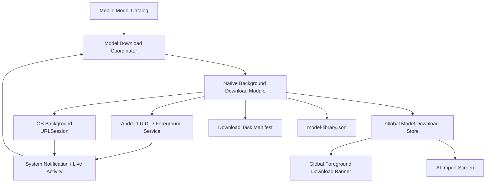
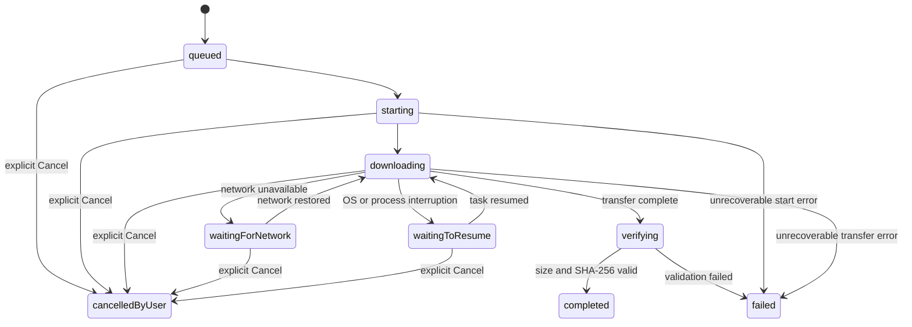

# Mobile AI Import Background Model Download Roadmap

本文档定义 Mobile App 中 `AI Import` 模型下载体验的稳定性优化方案，重点解决：

- 从 AI Import Screen 返回时页面卡顿或 App 无响应。
- 下载状态只能在 AI Import Screen 内显示。
- App 进入后台后模型下载无法被可靠追踪。
- 下载任务与页面生命周期绑定，离开页面可能触发额外清理。
- 下载中断、系统暂停和用户主动取消之间缺少明确语义。

本文档是 `docs/roadmap/desktop-ai-import.md` 中 Mobile AI Import 规划的专项补充。
总路线图继续定义本地推理、文件解析、review 和加密保存流程；本文档只负责模型下载、
全局进度、系统通知、取消语义和页面返回性能。

## 当前实现

当前 Mobile 模型下载由以下模块组成：

```text
apps/mobile/src/app/ai-import.tsx
apps/mobile/src/screens/ai-import/index.tsx
apps/mobile/src/features/ai-import/import-store.ts
apps/mobile/src/features/ai-import/model-manager.ts
apps/mobile/src/features/ai-import/model-catalog.ts
apps/mobile/src/features/ai-import/mobile-llama-runtime.ts
```

当前流程：

1. AI Import Screen 初始化模型列表。
2. 用户在模型卡片点击 `Download`。
3. `import-store.ts` 将导入阶段设置为 `downloading`。
4. `model-manager.ts` 使用 `expo-file-system/legacy` 的
   `DownloadResumable` 下载 `.partial` 文件。
5. 下载完成后校验文件大小和 SHA-256。
6. 校验通过后将 `.partial` 原子移动为最终 GGUF 文件，并更新
   `model-library.json`。

现有实现已经具备 allowlist catalog、大小校验、SHA-256、atomic rename 和 manifest，
这些能力应继续保留。

## 已确认问题

### 1. 页面订阅范围过大

`AiImportScreen` 当前通过以下方式订阅整个 Zustand store：

```ts
const state = useMobileImportStore();
```

模型下载过程中，每次进度回调都会更新 `downloadProgress`。由于整个页面订阅了全部
状态，包含模型卡片、文件列表、candidate 编辑表单和长 ScrollView 的整张页面都会
重新渲染。

模型文件大小约为 469MB 到 1.23GB，频繁进度事件会长期占用 JS thread，增加返回
动画掉帧、触摸无响应和页面卡顿的概率。

### 2. 页面生命周期与下载生命周期耦合

AI Import Screen 自己监听 `AppState`，并在页面卸载时调用
`handleAppBackground()`：

```ts
return () => {
  subscription.remove();
  void state.handleAppBackground();
};
```

`handleAppBackground()` 会停止正在运行的 AI extraction，并释放 Llama Context。
虽然当前逻辑不会直接取消下载，但返回页面会启动 native context 清理工作，导致导航
和资源释放同时发生。

下载任务属于 App 级长期任务，不应由单个 Screen 的 mount/unmount 控制。

### 3. 下载任务只存在于当前 JS Runtime

`model-manager.ts` 使用模块变量保存下载对象：

```ts
let activeDownload: FileSystem.DownloadResumable | null = null;
let activeDownloadModelId: MobileModelId | null = null;
```

这意味着：

- App 重启后无法从 manifest 恢复正在运行的任务。
- JS Runtime 被系统回收后无法重新绑定 progress callback。
- 当前页面以外没有独立的任务 owner。
- 系统通知无法直接控制这个 JS 对象。

### 4. 所有失败都会删除 partial

当前 catch 分支会删除 `.partial` 文件：

```ts
catch (error) {
  await FileSystem.deleteAsync(partialPath, { idempotent: true });
  throw error;
}
```

断网、App 被挂起、系统终止任务和用户主动 Cancel 都会丢失已下载内容。对于 1GB
左右的模型，这会造成明显的时间和流量浪费，也无法满足“只有手动 Cancel 才取消”
的产品要求。

## 产品目标

- 用户离开 AI Import Screen 后，模型下载继续运行。
- App 在前台时，所有页面都能看到全局下载进度。
- App 在后台时，系统通知区域显示模型名称、下载进度和 Cancel 操作。
- 点击通知主体后打开 AI Import Screen。
- 点击 App 内或系统通知中的 Cancel 后，才进入用户取消状态。
- 返回页面、切换 Tab、锁屏、进入后台、临时断网和系统暂停都不能被记录为用户取消。
- 下载任务能够在 App 重新启动后恢复或重新绑定。
- 同一时间只允许一个模型下载任务，避免磁盘、网络和状态冲突。
- 下载完成后继续执行文件大小、SHA-256 和 atomic rename 校验流程。
- 下载期间不得读取或上传用户导入文件；模型文件仍是 AI Import 唯一允许的网络请求。

## 非目标

- 本阶段不改变 `llama.rn` 的推理参数。
- 本阶段不让 AI extraction 在后台运行。只有模型文件下载支持后台运行。
- 本阶段不增加任意 URL 模型下载，继续使用 `MOBILE_MODEL_CATALOG` allowlist。
- 本阶段不支持多个模型并行下载。
- 本阶段不改变 candidate review 和 encrypted SQLite 保存流程。
- 本阶段不依赖远端服务器推送下载进度。

## 平台约束

### Android

模型下载是用户点击按钮后立即开始的大文件传输，符合 user-initiated data transfer
场景。

建议实现：

- Android 14 及以上优先使用 User-Initiated Data Transfer Job。
- Android 7 到 Android 13 使用 foreground service 或系统 DownloadManager。
- 下载期间保持 ongoing notification。
- 通知由 native 层更新，不依赖 React Native JS Runtime 持续存活。
- Cancel action 使用 `PendingIntent` 交给 `BroadcastReceiver` 或下载 service 处理。
- 点击通知主体使用 deep link 打开 `ai-import` route。
- 支持 HTTP Range 和本地 partial 文件，任务被系统暂停后可以继续下载。

Android 系统或用户仍可能通过系统 Task Manager 停止 App。该行为无法由业务代码完全
禁止，但必须与 App 内的 Cancel 区分：如果任务可恢复，则保留 partial 和任务记录；
不能把系统停止错误地写成 `cancelled-by-user`。

### iOS

建议使用 background `URLSessionDownloadTask`：

- 下载由系统 transfer daemon 管理，App 进入后台或被系统回收后仍可继续。
- App 恢复时重建同 identifier 的 background session，并重新绑定任务。
- 保存 resume data 或可恢复的 partial 信息。
- 下载完成后由 native delegate 完成文件交接，并通知 JS store 刷新状态。

iOS 通知展示需要分级实现：

- iOS 16.1 及以上可以使用 Live Activity 展示模型名称和进度。
- 支持交互式 Live Activity 的系统版本可以提供原生 Cancel action。
- 不支持 Live Activity 的版本使用本地通知，至少显示模型名称、百分比文本和 Cancel
  category action。
- 点击通知或 Live Activity 主体通过 URL scheme 打开 AI Import Screen。

iOS 不提供与 Android 完全一致的常驻 determinate progress notification。系统可能合并
后台 progress callback，因此通知中的百分比可能低频更新，但下载本身仍应继续。

如果用户从 App Switcher 明确强制结束 App，iOS 会取消 background URLSession
transfer。这是系统限制，无法保证继续下载。重新打开 App 后应保留可恢复数据，并将
任务标记为 `interrupted` 或 `waiting-to-resume`，不能标记为用户点击了 Cancel。

## Mobile Checkpoint

```text
Platform:     iOS + Android
Framework:    Expo 54 + React Native 0.81 + Expo Router
Navigation:   Root Stack + Tabs
Offline:      已下载模型和导入流程离线可用；模型下载需要网络
Devices:      Phone 为专项验收目标；Tablet 保持可运行

3 Principles:
1. 下载任务归属于 App，而不是归属于 AI Import Screen。
2. 系统暂停、失败和用户取消必须是不同状态。
3. 高频进度不能驱动整张页面重新渲染。

Anti-Patterns:
1. 不在 Screen cleanup 中停止或删除下载任务。
2. 不依赖 JS setInterval 维持后台下载或通知进度。
```

## 目标架构



职责边界：

| 模块 | 职责 |
| --- | --- |
| Model Catalog | 模型 allowlist、URL、size、SHA-256 和展示信息 |
| Download Coordinator | 单任务约束、状态转换、恢复、校验和完成处理 |
| Native Module | 后台传输、native progress、取消、通知和任务重连 |
| Global Store | 为 React UI 提供轻量、可订阅的任务快照 |
| Global Banner | App 前台跨页面展示进度并提供 Cancel |
| AI Import Screen | 选择模型、启动下载、展示模型库，不再拥有下载生命周期 |
| Task Manifest | 持久化 active task、partial、resume data 和错误状态 |
| Model Library | 只记录已经完成校验、可用于推理的模型 |

## Native Module 方案

建议新增项目内 Expo Native Module：

```text
apps/mobile/modules/expo-model-download/
  android/
  ios/
  src/
    index.ts
  expo-module.config.json
```

不建议继续把后台能力叠加到 `expo-file-system/legacy`：

- JS `DownloadResumable` 实例不能作为可靠的跨重启任务标识。
- Android 通知 Cancel 必须在 JS Runtime 不运行时仍可执行。
- iOS background URLSession 需要稳定 identifier 和 AppDelegate 回调。
- 任务恢复和系统通知属于 native lifecycle，不属于普通文件工具函数。

第三方 background downloader 可以用于快速 POC，但正式实现优先采用项目内 module，
原因是通知布局、Cancel 语义、manifest、SHA-256 和 Expo config plugin 都需要与当前
模型库深度集成。

### TypeScript API

建议暴露以下最小 API：

```ts
type ModelDownloadState =
  | 'queued'
  | 'starting'
  | 'downloading'
  | 'waiting-for-network'
  | 'waiting-to-resume'
  | 'verifying'
  | 'completed'
  | 'failed'
  | 'cancelled-by-user';

interface NativeModelDownloadTask {
  taskId: string;
  modelId: MobileModelId;
  state: ModelDownloadState;
  sourceUrl: string;
  partialPath: string;
  finalPath: string;
  downloadedBytes: number;
  totalBytes: number;
  createdAt: string;
  updatedAt: string;
  errorCode?: string;
}

interface StartModelDownloadInput {
  taskId: string;
  modelId: MobileModelId;
  url: string;
  destination: string;
  expectedBytes: number;
}

startModelDownload(input: StartModelDownloadInput): Promise<void>;
getActiveModelDownload(): Promise<NativeModelDownloadTask | null>;
cancelModelDownload(taskId: string): Promise<void>;
resumeModelDownload(taskId: string): Promise<void>;
addModelDownloadListener(
  listener: (task: NativeModelDownloadTask) => void
): Subscription;
```

Native module 不负责读取用户导入文件，也不负责运行 Llama。它只允许下载 catalog 中
经过 JS 和 native 双重验证的模型 URL。

## 持久化任务模型

现有 `model-library.json` 只应记录已验证模型，不应混入未完成任务。建议新增：

```text
models/model-download-tasks.json
```

建议结构：

```ts
interface ModelDownloadTaskManifest {
  version: 1;
  activeTask: {
    taskId: string;
    modelId: MobileModelId;
    state: ModelDownloadState;
    sourceUrl: string;
    partialPath: string;
    finalPath: string;
    downloadedBytes: number;
    totalBytes: number;
    createdAt: string;
    updatedAt: string;
    retryCount: number;
    userCancelledAt?: string;
    errorCode?: string;
    etag?: string;
  } | null;
}
```

持久化规则：

- 每次关键状态转换必须原子写入。
- 高频 bytes progress 可以节流到每 500ms 或每增加 1% 写入一次。
- `model-library.json` 只在 SHA-256 校验通过后更新。
- `cancelled-by-user` 必须记录 `userCancelledAt`。
- 系统暂停、网络错误或 App 被回收不得写入 `userCancelledAt`。
- 用户 Cancel 后删除 partial、resume data、native task 和 active manifest。
- 非用户中断默认保留 partial，并尝试 Range resume。

## 状态机



状态语义：

- `waiting-for-network`：等待网络，不是失败，不删除 partial。
- `waiting-to-resume`：系统或进程中断，等待恢复，不是用户取消。
- `failed`：无法自动恢复，需要用户点击 Retry，不删除可复用 partial，除非文件损坏。
- `cancelled-by-user`：只能由 App Banner、AI Import Screen 或系统通知中的 Cancel
  触发。
- `completed`：只表示文件下载、大小和 SHA-256 全部通过。

## 页面返回卡顿修复

### 1. 移除 Screen 级下载生命周期

AI Import Screen 不再负责：

- 监听 AppState 来管理模型下载。
- 页面卸载时清理下载对象。
- 页面卸载时等待 native 下载相关 Promise。

AI extraction 的后台处理可以继续保留，但应移动到根级 lifecycle coordinator，避免
页面返回和 Llama Context release 同时争用资源。

### 2. 使用精确 Zustand selector

禁止 AI Import Screen 订阅整个 store。按组件选择最小状态：

```ts
const stage = useMobileImportStore(state => state.stage);
const models = useMobileImportStore(state => state.models);
const selectedModelId = useMobileImportStore(
  state => state.selectedModelId
);
```

下载进度由独立组件订阅：

```ts
const progress = useModelDownloadStore(state => state.activeTask?.fraction);
```

`ModelCard` 使用 `React.memo`，并避免每个 progress tick 重建所有 handler。

### 3. 节流 UI 更新

Native 层可以高频接收 bytes，但 JS 事件建议：

- 前台最多每 250ms 到 500ms发送一次。
- 百分比和 bytes 没变化时不发事件。
- App 在后台时不依赖 JS 更新系统通知。
- 返回动画期间不执行同步 SHA-256 或大文件 IO。

### 4. 非阻塞资源释放

返回 AI Import Screen 时：

- 导航立即执行。
- 只有正在 processing 时才停止 completion。
- Context release 放到 coordinator 串行执行。
- Downloading 状态绝不触发 Llama Context 初始化或释放。

## 前台全局下载组件

在 Root provider 内增加：

```text
ModelDownloadProvider
GlobalModelDownloadBanner
```

建议挂载位置：

```tsx
<ThemeProvider>
  <ModelDownloadProvider>
    <Render />
    <GlobalModelDownloadBanner />
  </ModelDownloadProvider>
</ThemeProvider>
```

Banner 在 App active 且存在 active download 时显示，包含：

- 模型名称。
- 百分比。
- 已下载大小和总大小。
- determinate progress bar。
- `Cancel` 按钮。
- 点击非 Cancel 区域进入 `/ai-import`。

交互要求：

- 最小触摸区域 iOS 44pt、Android 48dp。
- Cancel 与打开页面操作必须有足够间距，避免误触。
- Cancel 是 destructive action，需要二次确认或短时 undo 策略。
- Banner 不遮挡底部 Tab Bar、系统 Home Indicator 或页面主要按钮。
- 前台只显示 App Banner，不重复弹出 heads-up notification。
- 下载完成后 Banner 转为短暂 success 状态，然后自动收起。
- 下载失败时显示 Retry 和错误摘要，但不自动删除 partial。

AI Import Screen 的模型卡片继续展示同一任务的进度，但它只是全局任务状态的一个
view，不再拥有独立下载状态。

## 系统通知设计

### Android Notification

下载通知建议包含：

```text
Title: Downloading AI model
Model: Qwen3 1.7B Q4_0
Progress: 47% · 579 MB / 1.15 GB
Actions: Cancel
Tap: Open AI Import
```

要求：

- 使用固定 notification ID 更新同一张卡片。
- 下载期间设置 ongoing，避免被普通 swipe 意外清除。
- Channel 使用 low importance，不播放声音、不振动。
- 进度由 native download service 更新。
- Cancel action 直接调用 native task cancel，不先启动 React Native UI。
- 点击主体打开 App，并由 Expo Router 进入 `/ai-import`。
- 完成、失败和 waiting 状态使用不同文案。

### iOS Notification / Live Activity

Live Activity 内容建议包含：

```text
Downloading AI model
Qwen3 1.7B Q4_0
47% · 579 MB / 1.15 GB
[Cancel]
```

要求：

- 支持时优先使用 Live Activity。
- 不支持时降级为可更新的本地通知文本。
- 通知 category 注册 `CANCEL_MODEL_DOWNLOAD` action。
- Cancel 由 native notification delegate 或 App Intent 处理。
- 点击主体打开 `APP_SLUG://ai-import`。
- 不请求 remote push token；这是纯本地任务。
- 后台进度刷新频率服从 iOS 调度，不承诺每个百分比都实时显示。

## Deep Link

项目已经在 `app.config.ts` 中配置 `scheme: APP_SLUG`。建议统一使用：

```text
APP_SLUG://ai-import
```

App 冷启动时必须处理初始 notification response：

1. Root providers 初始化。
2. Download coordinator 恢复 active task。
3. Expo Router 导航到 `/ai-import`。
4. Screen 从 global store 读取任务，不重复创建下载。

如果 AI Import Screen 已经位于栈顶，点击通知不得重复 push 多个相同页面。

## Cancel 语义

产品要求中的“只有手动点击 Cancel 才能取消下载”定义为：

| 事件 | 是否取消 | 是否删除 partial | 状态 |
| --- | --- | --- | --- |
| 返回上一级页面 | 否 | 否 | downloading |
| 切换 Tab | 否 | 否 | downloading |
| App 进入后台 | 否 | 否 | downloading |
| 锁屏 | 否 | 否 | downloading |
| 临时断网 | 否 | 否 | waiting-for-network |
| 系统暂停任务 | 否 | 否 | waiting-to-resume |
| JS Runtime 被系统回收 | 否 | 否 | native task continues / waiting-to-resume |
| App 重启 | 否 | 否 | restore active task |
| 下载校验失败 | 否 | 视损坏情况 | failed |
| App 内点击 Cancel | 是 | 是 | cancelled-by-user |
| 通知中点击 Cancel | 是 | 是 | cancelled-by-user |
| iOS 用户强制结束 App | 系统终止，不记作业务 Cancel | 否，尽量保留恢复数据 | interrupted |
| Android Task Manager Stop | 系统终止，不记作业务 Cancel | 否，尽量保留 partial | interrupted |

所有 Cancel 入口调用同一个 coordinator command：

```ts
cancelModelDownload(taskId, { reason: 'user' });
```

禁止使用通用的 `cancelCurrentOperation()` 同时取消下载和 AI extraction。两者应拆分为：

```ts
cancelModelDownload();
cancelImportProcessing();
```

这样可以避免用户只想停止一次 extraction，却意外删除正在后台下载的模型。

## 下载完成和校验

下载完成不等于模型 ready。完整流程：

1. Native transfer 写入 `.partial`。
2. 检查实际文件大小。
3. 进入 `verifying`。
4. 使用现有 `expo-file-hash` 或 native streaming SHA-256 校验。
5. SHA-256 与 catalog 一致后 atomic rename。
6. 更新 `model-library.json`。
7. 清除 active download manifest。
8. Store 更新模型列表。
9. 通知和 Banner 显示完成状态。

SHA-256 校验属于 CPU 和 IO 密集操作：

- 不在返回导航回调中执行。
- UI 显示 `Verifying model`，不能停留在假 100%。
- 校验阶段仍允许 Cancel，但需要定义为停止校验并删除 partial。
- 校验失败后禁止把模型标记为 downloaded。

## 建议文件变更

### 新增

```text
apps/mobile/modules/expo-model-download/
apps/mobile/src/features/model-download/download-coordinator.ts
apps/mobile/src/features/model-download/download-store.ts
apps/mobile/src/features/model-download/download-provider.tsx
apps/mobile/src/features/model-download/types.ts
apps/mobile/src/components/model-download-banner/index.tsx
```

### 修改

```text
apps/mobile/app.config.ts
apps/mobile/package.json
apps/mobile/src/screens/root/index.tsx
apps/mobile/src/screens/root/render.tsx
apps/mobile/src/screens/ai-import/index.tsx
apps/mobile/src/features/ai-import/import-store.ts
apps/mobile/src/features/ai-import/model-manager.ts
apps/mobile/src/features/ai-import/types.ts
```

调整方向：

- `model-manager.ts` 保留 model library、hash 和最终文件管理。
- native background transfer 移到 `features/model-download` 和 Expo Module。
- `import-store.ts` 不再保存 `downloadProgress`，只管理 import workflow。
- Root provider 负责 AppState、任务恢复和 notification response。
- AI Import Screen 使用 selectors 读取 import state 和 download state。

## 实施阶段

### Phase 1: 返回卡顿和状态拆分

- 从 AI Import Screen 移除无条件 screen cleanup。
- 将 AppState handling 移到根级 provider。
- 拆分 `cancelModelDownload` 与 `cancelImportProcessing`。
- 为 Zustand 使用精确 selectors。
- 将下载进度渲染隔离为 memoized component。
- 对 JS progress 更新节流。

完成标准：

- 下载过程中返回上一级页面无明显卡顿。
- 返回后下载不停止。
- 其他页面操作保持流畅。

### Phase 2: Global Download Coordinator

- 新建独立 download store 和 coordinator。
- 新增 task manifest。
- App 启动时恢复 active task。
- 保留 partial，并实现 Range resume。
- 下载完成后复用现有 size、SHA-256 和 atomic rename。

完成标准：

- AI Import Screen 卸载后任务仍存在。
- App 重启后 UI 能恢复模型、bytes 和任务状态。
- 非用户中断不会删除 partial。

### Phase 3: 前台全局 Banner

- 在 Root provider 中挂载 Banner。
- 支持模型名、进度、bytes、Cancel 和点击跳转。
- AI Import Screen 模型卡片复用 global task。
- 增加 success、failed、waiting 状态。

完成标准：

- App 任意页面都能看到当前模型下载。
- 只有一个进度 source of truth。
- Cancel 在任意前台页面行为一致。

### Phase 4: Android Background Download

- 实现 UIDT / foreground service fallback。
- 实现 native notification progress。
- 实现 notification Cancel receiver。
- 实现 deep link 和 cold start restore。
- 完成 Android 14+ foreground/UIDT 权限和 Play Console 声明检查。

完成标准：

- App 后台和锁屏时继续下载。
- 通知展示模型、进度和 Cancel。
- 点击通知打开 AI Import Screen。
- JS Runtime 不活跃时 Cancel 仍可执行。

### Phase 5: iOS Background Download

- 实现 background URLSession。
- 配置稳定 session identifier 和 AppDelegate callback。
- 实现 session/task reattachment。
- 实现 Live Activity 和 notification fallback。
- 实现 native notification action 和 deep link。

完成标准：

- 正常进入后台后下载继续。
- App 被系统回收后可以恢复任务状态。
- 支持的系统版本显示模型、进度和 Cancel。
- 强制结束 App 后重新打开可进入 interrupted/recovery 流程。

### Phase 6: 稳定性和发布验证

- 验证 Wi-Fi 与 cellular 切换。
- 验证断网、弱网、代理、Hugging Face redirect 和 Range support。
- 验证磁盘不足、hash mismatch 和 partial 损坏。
- 验证系统回收、重启、锁屏和通知权限拒绝。
- 验证 development、preview 和 production EAS Build。
- 验证 Android foreground service / UIDT 商店声明。
- 验证 iOS Live Activity entitlement 和 Widget extension 打包。

## 测试矩阵

### 导航与性能

- 下载 0%、25%、75%、99% 时点击返回。
- 使用 header back、Android system back 和 iOS swipe-back。
- 连续进入和退出 AI Import Screen。
- 下载中切换 Tabs、打开密码详情和编辑弹窗。
- 使用 React Native profiler 检查 progress tick 是否重渲染整个 Screen。
- 返回操作到首帧响应目标小于 100ms，不等待文件 IO 或 context release。

### 下载恢复

- 前台下载。
- 后台下载。
- 锁屏下载。
- 断网后恢复。
- Wi-Fi 切换 cellular。
- App 被系统回收后重新打开。
- App 更新或 native process 重建后读取 manifest。
- partial 存在但 native task 丢失。
- native task 存在但 JS manifest 落后。

### Cancel

- AI Import Screen Cancel。
- Global Banner Cancel。
- Android notification Cancel。
- iOS notification / Live Activity Cancel。
- Cancel 与 download completion 同时发生的 race condition。
- 连续点击 Cancel。
- Cancel 后立即重新下载同一模型。
- Cancel 后确认 partial、resume data、notification 和 active manifest 已清理。

### 完整性

- Content-Length 正常。
- Content-Length 缺失或变化。
- Redirect 后下载。
- Range resume 返回 206。
- Server 不支持 Range 时安全地重新开始。
- 文件大小不匹配。
- SHA-256 不匹配。
- atomic rename 失败。
- 磁盘空间不足。

### 通知和跳转

- App 前台不重复弹 heads-up notification。
- App 后台显示 ongoing notification。
- 点击通知冷启动到 AI Import Screen。
- 点击通知热启动且 AI Import 已在栈顶。
- 通知权限拒绝时下载仍能按平台允许范围运行，并在 App 内显示状态。
- 下载完成后通知正确结束或转换为完成状态。

## 验收标准

- 模型下载时从 AI Import Screen 返回，不出现 App 无响应。
- 返回、切 Tab、进入后台和锁屏不会取消下载。
- App 前台任意页面显示全局模型下载组件。
- 全局组件显示模型名、进度、bytes 和 Cancel。
- App 后台时系统区域展示模型下载状态。
- 点击系统下载卡片进入 AI Import Screen。
- Android 系统卡片提供可用的 Cancel action。
- 支持的 iOS 版本通过 Live Activity 或 notification action 提供 Cancel。
- 只有显式 Cancel 才写入 `cancelled-by-user` 并删除 partial。
- 断网和系统中断保留 partial，并进入 waiting/recovery 状态。
- App 重启后能恢复或重新绑定未完成任务。
- 同一时间最多存在一个 active model download。
- 下载完成后必须通过大小和 SHA-256 校验才能进入 model library。
- 下载、通知和任务 manifest 不包含用户导入文件内容、prompt、模型输出或密码。

## 风险和决策点

### 1. iOS 通知能力不完全对称

Android 可以稳定展示原生 determinate progress notification。iOS 更适合使用 Live
Activity，但不同系统版本的进度刷新和交互能力不同。产品验收应以“下载继续、状态
可见、可进入 App、支持的版本可 Cancel”为底线，不要求 iOS 与 Android 像素级一致。

### 2. 系统级停止无法完全禁止

“只有手动 Cancel 才取消”是 App 业务语义，不代表操作系统永远不会终止任务。
系统可能因强制结束、资源压力、网络策略或用户在系统 Task Manager 停止 App 而中断
下载。实现必须保留可恢复数据，并确保这些事件不会冒充 App 内 Cancel。

### 3. Hugging Face Range 行为

断点续传依赖最终下载 URL 支持 `Range`、稳定 ETag 和 redirect 后 header 行为。
实施前需要用三个 catalog artifact 做真机和命令行验证。如果某个源不稳定，应为 catalog
增加受控镜像 URL，而不是让用户输入任意 URL。

### 4. Native 维护成本

项目内 Expo Module 会增加 Swift、Kotlin、通知和 EAS Build 维护成本，但能够提供明确
的任务恢复、通知 Cancel、安全约束和平台适配。该成本是满足当前产品要求的必要部分。

## 参考

- [Expo FileSystem](https://docs.expo.dev/versions/latest/sdk/filesystem/)
- [Expo Notifications](https://docs.expo.dev/versions/latest/sdk/notifications/)
- [Android User-Initiated Data Transfer](https://developer.android.com/develop/background-work/background-tasks/uidt)
- [Android Data Transfer Background Task Options](https://developer.android.com/develop/background-work/background-tasks/data-transfer-options)
- [Apple Background Downloads](https://developer.apple.com/documentation/foundation/downloading-files-in-the-background)
- [Apple Background URLSession Configuration](https://developer.apple.com/documentation/foundation/urlsessionconfiguration/background(withidentifier:))
- [Apple Live Activity Interactions](https://developer.apple.com/documentation/widgetkit/adding-interactivity-to-widgets-and-live-activities)

